# python-api-challenge


# Background
[Project Details](project_instructions_readme.md)

# Setup Instructions
In order to run these programs, a file called api_keys.py needs to be created in both WeatherPy and VacationPy with your OpenWeather and Google maps api keys updated using the following formation:

weather_api_key = ""

g_key = ""

 
## Observations and Insights 
* The only comparison that has a strong or moderate correlation is Latitude and Max Temperature.  The further someone is away from the equator to the south, the lower the temperature. And conversely the further north from the equator the higher the temperature.
* There are quite a few points where the humitity is higher for locations  south of the equator and north of the equator but there are also quite a few points that do not exhibit this behavior. So any correlection would be "weak" or "none or very weak". And indeed that is the results that was  obtained from linear regression of the hemisphere data.  Therefore no conclusions can be drawn for humidity from latitude.
* The cloudiness points are distributed over the entire plot.  Therefore there would be "none or very weak" correletion between latitude and Cloudiness.  And indeed that is what was discovered via linear regression.
* Most of the Wind Speed points are less than 20 mph with very few outliers.  There is not any correletion between Wind Speed and Latitude. 

# WeatherPy
----

#### Note
* Instructions have been included for each segment. You do not have to follow them exactly, but they are included to help you think through the steps.


```python
# Dependencies
import pandas as pd
import matplotlib.pyplot as plt
import numpy as np
import requests
import json
import csv
import datetime
import time
from citipy import citipy
import random
from scipy.stats import linregress

# Google API Key
from api_keys import weather_api_key

#random.seed(333)
```

## Generate Cities List


```python
# Setup the ranges for latitude and longitude
latitude_range = (-90,90)
longatude_range = (-180,180)

# Create variables for data
cities = []

no_cities = 2000
for cntr in range(no_cities):
    latitude = random.uniform(latitude_range[0],latitude_range[1])
    longitude = random.uniform(longatude_range[0],longatude_range[1])
    
    # If we have chosen a latitude of 0 then we don't want 
    # to use that latitude and longitude
    if latitude != 0:
        city = citipy.nearest_city(latitude,longitude)
        city_name = city.city_name
        city_country = city.country_code
        
        # Only add if we have not already chosen the city and country combination
        if not any(c['name'] == city_name and c['country'] == city_country for c in cities):
            city_dict = {'name': city_name,'country': city_country}
            cities.append(city_dict)
```


```python
# Output cities to verify
print(cities)
```

    [{'name': 'bluff', 'country': 'nz'}, {'name': 'sao joao da barra', 'country': 'br'}, {'name': 'ushuaia', 'country': 'ar'}, {'name': 'ponta do sol', 'country': 'cv'}, {'name': 'high level', 'country': 'ca'}, {'name': 'victoria', 'country': 'sc'}, {'name': 'la ronge', 'country': 'ca'}, {'name': 'nerchinskiy zavod', 'country': 'ru'}, {'name': 'vrangel', 'country': 'ru'}, {'name': 'souillac', 'country': 'mu'}, {'name': 'sfantu gheorghe', 'country': 'ro'}, {'name': 'tsihombe', 'country': 'mg'}, {'name': 'komsomolskiy', 'country': 'ru'}, {'name': 'taolanaro', 'country': 'mg'}, {'name': 'albany', 'country': 'au'}, {'name': 'raudeberg', 'country': 'no'}, {'name': 'vaini', 'country': 'to'}, {'name': 'nikolskoye', 'country': 'ru'}, {'name': 'hermanus', 'country': 'za'}, {'name': 'qaanaaq', 'country': 'gl'}, {'name': 'prince rupert', 'country': 'ca'}, {'name': 'new norfolk', 'country': 'au'}, {'name': 'kerema', 'country': 'pg'}, {'name': 'songkhla', 'country': 'th'}, {'name': 'havoysund', 'country': 'no'}, {'name': 'leningradskiy', 'country': 'ru'}, {'name': 'chuy', 'country': 'uy'}, {'name': 'obidos', 'country': 'br'}, {'name': 'adrar', 'country': 'dz'}, {'name': 'te anau', 'country': 'nz'}, {'name': 'hilo', 'country': 'us'}, {'name': 'clyde river', 'country': 'ca'}, {'name': 'punta arenas', 'country': 'cl'}, {'name': 'mys shmidta', 'country': 'ru'}, {'name': 'talnakh', 'country': 'ru'}, {'name': 'bethel', 'country': 'us'}, {'name': 'skelleftea', 'country': 'se'}, {'name': 'newport', 'country': 'us'}, {'name': 'pangnirtung', 'country': 'ca'}, {'name': 'thompson', 'country': 'ca'}, {'name': 'praia', 'country': 'cv'}, {'name': 'dunedin', 'country': 'nz'}, {'name': 'margate', 'country': 'za'}, {'name': 'chokurdakh', 'country': 'ru'}, {'name': 'cape town', 'country': 'za'}, {'name': 'pitimbu', 'country': 'br'}, {'name': 'waddan', 'country': 'ly'}, {'name': 'hithadhoo', 'country': 'mv'}, {'name': 'pogar', 'country': 'ru'}, {'name': 'lolua', 'country': 'tv'}, {'name': 'bredasdorp', 'country': 'za'}, {'name': 'lagoa', 'country': 'pt'}, {'name': 'arman', 'country': 'ru'}, {'name': 'luba', 'country': 'gq'}, {'name': 'mataura', 'country': 'pf'}, {'name': 'nago', 'country': 'jp'}, {'name': 'khatanga', 'country': 'ru'}, {'name': 'yellowknife', 'country': 'ca'}, {'name': 'butaritari', 'country': 'ki'}, {'name': 'castro', 'country': 'cl'}, {'name': 'atuona', 'country': 'pf'}, {'name': 'cururupu', 'country': 'br'}, {'name': 'port alfred', 'country': 'za'}, {'name': 'erenhot', 'country': 'cn'}, {'name': 'umzimvubu', 'country': 'za'}, {'name': 'rikitea', 'country': 'pf'}, {'name': 'ruatoria', 'country': 'nz'}, {'name': 'avarua', 'country': 'ck'}, {'name': 'kupang', 'country': 'id'}, {'name': 'fevralsk', 'country': 'ru'}, {'name': 'meulaboh', 'country': 'id'}, {'name': 'amderma', 'country': 'ru'}, {'name': 'yuci', 'country': 'cn'}, {'name': 'saint-leu', 'country': 're'}, {'name': 'vaitupu', 'country': 'wf'}, {'name': 'altay', 'country': 'cn'}, {'name': 'dingle', 'country': 'ie'}, {'name': 'koshurnikovo', 'country': 'ru'}, {'name': 'yaan', 'country': 'cn'}, {'name': 'lata', 'country': 'sb'}, {'name': 'opuwo', 'country': 'na'}, {'name': 'slave lake', 'country': 'ca'}, {'name': 'thiruvananthapuram', 'country': 'in'}, {'name': 'naze', 'country': 'jp'}, {'name': 'aktas', 'country': 'kz'}, {'name': 'yar-sale', 'country': 'ru'}, {'name': 'hualmay', 'country': 'pe'}, {'name': 'narsaq', 'country': 'gl'}, {'name': 'mahibadhoo', 'country': 'mv'}, {'name': 'natchitoches', 'country': 'us'}, {'name': 'busselton', 'country': 'au'}, {'name': 'wenzhou', 'country': 'cn'}, {'name': 'maryborough', 'country': 'au'}, {'name': 'mar del plata', 'country': 'ar'}, {'name': 'upernavik', 'country': 'gl'}, {'name': 'samarai', 'country': 'pg'}, {'name': 'tuatapere', 'country': 'nz'}, {'name': 'kodiak', 'country': 'us'}, {'name': 'lavrentiya', 'country': 'ru'}, {'name': 'katsuura', 'country': 'jp'}, {'name': 'bourail', 'country': 'nc'}, {'name': 'atar', 'country': 'mr'}, {'name': 'seoul', 'country': 'kr'}, {'name': 'illoqqortoormiut', 'country': 'gl'}, {'name': 'longyearbyen', 'country': 'sj'}, {'name': 'codrington', 'country': 'ag'}, {'name': 'pangody', 'country': 'ru'}, {'name': 'port lincoln', 'country': 'au'}, {'name': 'padang', 'country': 'id'}, {'name': 'san quintin', 'country': 'mx'}, {'name': 'kruisfontein', 'country': 'za'}, {'name': 'tasiilaq', 'country': 'gl'}, {'name': 'mirnyy', 'country': 'ru'}, {'name': 'dikson', 'country': 'ru'}, {'name': 'ahipara', 'country': 'nz'}, {'name': 'mae hong son', 'country': 'th'}, {'name': 'buin', 'country': 'pg'}, {'name': 'saskylakh', 'country': 'ru'}, {'name': 'hobart', 'country': 'au'}, {'name': 'port elizabeth', 'country': 'za'}, {'name': 'kulhudhuffushi', 'country': 'mv'}, {'name': 'ambanja', 'country': 'mg'}, {'name': 'arraial do cabo', 'country': 'br'}, {'name': 'portland', 'country': 'au'}, {'name': 'east london', 'country': 'za'}, {'name': 'rocha', 'country': 'uy'}, {'name': 'ribas do rio pardo', 'country': 'br'}, {'name': 'saint-denis', 'country': 're'}, {'name': 'west wendover', 'country': 'us'}, {'name': 'kerrobert', 'country': 'ca'}, {'name': 'japura', 'country': 'br'}, {'name': 'kot diji', 'country': 'pk'}, {'name': 'norman wells', 'country': 'ca'}, {'name': 'manokwari', 'country': 'id'}, {'name': 'saint anthony', 'country': 'ca'}, {'name': 'khandyga', 'country': 'ru'}, {'name': 'half moon bay', 'country': 'us'}, {'name': 'henties bay', 'country': 'na'}, {'name': 'sao filipe', 'country': 'cv'}, {'name': 'kochi', 'country': 'in'}, {'name': 'ormstown', 'country': 'ca'}, {'name': 'black river', 'country': 'jm'}, {'name': 'petropavlovsk-kamchatskiy', 'country': 'ru'}, {'name': 'tomatlan', 'country': 'mx'}, {'name': 'diu', 'country': 'in'}, {'name': 'georgetown', 'country': 'sh'}, {'name': 'venice', 'country': 'us'}, {'name': 'jamestown', 'country': 'sh'}, {'name': 'iqaluit', 'country': 'ca'}, {'name': 'barrow', 'country': 'us'}, {'name': 'regina', 'country': 'ca'}, {'name': 'puerto ayora', 'country': 'ec'}, {'name': 'tuktoyaktuk', 'country': 'ca'}, {'name': 'tura', 'country': 'ru'}, {'name': 'zyryanka', 'country': 'ru'}, {'name': 'douglas', 'country': 'us'}, {'name': 'sentyabrskiy', 'country': 'ru'}, {'name': 'higuey', 'country': 'do'}, {'name': 'palabuhanratu', 'country': 'id'}, {'name': 'araouane', 'country': 'ml'}, {'name': 'toliary', 'country': 'mg'}, {'name': 'kapaa', 'country': 'us'}, {'name': 'vao', 'country': 'nc'}, {'name': 'makakilo city', 'country': 'us'}, {'name': 'akyab', 'country': 'mm'}, {'name': 'poum', 'country': 'nc'}, {'name': 'sitka', 'country': 'us'}, {'name': 'celle', 'country': 'de'}, {'name': 'laurinburg', 'country': 'us'}, {'name': 'bathsheba', 'country': 'bb'}, {'name': 'bengkulu', 'country': 'id'}, {'name': 'baherden', 'country': 'tm'}, {'name': 'olinda', 'country': 'br'}, {'name': 'sur', 'country': 'om'}, {'name': 'nanortalik', 'country': 'gl'}, {'name': 'sao luiz gonzaga', 'country': 'br'}, {'name': 'hit', 'country': 'iq'}, {'name': 'hailin', 'country': 'cn'}, {'name': 'aklavik', 'country': 'ca'}, {'name': 'vung tau', 'country': 'vn'}, {'name': 'amapa', 'country': 'br'}, {'name': 'puerto madryn', 'country': 'ar'}, {'name': 'barentsburg', 'country': 'sj'}, {'name': 'samusu', 'country': 'ws'}, {'name': 'kenai', 'country': 'us'}, {'name': 'altagracia de orituco', 'country': 've'}, {'name': 'gomel', 'country': 'by'}, {'name': 'vila velha', 'country': 'br'}, {'name': 'pisco', 'country': 'pe'}, {'name': 'ambodifototra', 'country': 'mg'}, {'name': 'carnarvon', 'country': 'au'}, {'name': 'kolokani', 'country': 'ml'}, {'name': 'kaitangata', 'country': 'nz'}, {'name': 'quelimane', 'country': 'mz'}, {'name': 'pontes e lacerda', 'country': 'br'}, {'name': 'road town', 'country': 'vg'}, {'name': 'saint-pacome', 'country': 'ca'}, {'name': 'mandurah', 'country': 'au'}, {'name': 'mecca', 'country': 'sa'}, {'name': 'tilichiki', 'country': 'ru'}, {'name': 'saint-paul', 'country': 're'}, {'name': 'kudat', 'country': 'my'}, {'name': 'egvekinot', 'country': 'ru'}, {'name': 'aswan', 'country': 'eg'}, {'name': 'bundaberg', 'country': 'au'}, {'name': 'klaksvik', 'country': 'fo'}, {'name': 'esperance', 'country': 'au'}, {'name': 'gardan diwal', 'country': 'af'}, {'name': 'faanui', 'country': 'pf'}, {'name': 'sambava', 'country': 'mg'}, {'name': 'cidreira', 'country': 'br'}, {'name': 'shellbrook', 'country': 'ca'}, {'name': 'bambous virieux', 'country': 'mu'}, {'name': 'willowmore', 'country': 'za'}, {'name': 'guerrero negro', 'country': 'mx'}, {'name': 'lebu', 'country': 'cl'}, {'name': 'port hardy', 'country': 'ca'}, {'name': 'ribeira grande', 'country': 'pt'}, {'name': 'asayita', 'country': 'et'}, {'name': 'stellenbosch', 'country': 'za'}, {'name': 'cayhagan', 'country': 'ph'}, {'name': 'nome', 'country': 'us'}, {'name': 'college', 'country': 'us'}, {'name': 'cockburn town', 'country': 'tc'}, {'name': 'alamogordo', 'country': 'us'}, {'name': 'cherskiy', 'country': 'ru'}, {'name': 'chipoka', 'country': 'mw'}, {'name': 'fairbanks', 'country': 'us'}, {'name': 'saint george', 'country': 'bm'}, {'name': 'attawapiskat', 'country': 'ca'}, {'name': 'pierre', 'country': 'us'}, {'name': 'yerbogachen', 'country': 'ru'}, {'name': 'hamilton', 'country': 'bm'}, {'name': 'azimur', 'country': 'ma'}, {'name': 'ostrovnoy', 'country': 'ru'}, {'name': 'saint-philippe', 'country': 're'}, {'name': 'eureka', 'country': 'us'}, {'name': 'rio grande', 'country': 'br'}, {'name': 'karamea', 'country': 'nz'}, {'name': 'haibowan', 'country': 'cn'}, {'name': 'kommunar', 'country': 'ru'}, {'name': 'ilulissat', 'country': 'gl'}, {'name': 'constitucion', 'country': 'mx'}, {'name': 'swan river', 'country': 'ca'}, {'name': 'kapit', 'country': 'my'}, {'name': 'ciras', 'country': 'af'}, {'name': 'nemuro', 'country': 'jp'}, {'name': 'naraura', 'country': 'in'}, {'name': 'nizhneyansk', 'country': 'ru'}, {'name': 'kirakira', 'country': 'sb'}, {'name': 'severo-kurilsk', 'country': 'ru'}, {'name': 'dawei', 'country': 'mm'}, {'name': 'kuche', 'country': 'cn'}, {'name': 'richards bay', 'country': 'za'}, {'name': 'provideniya', 'country': 'ru'}, {'name': 'galesong', 'country': 'id'}, {'name': 'pacific grove', 'country': 'us'}, {'name': 'burica', 'country': 'pa'}, {'name': 'hecun', 'country': 'cn'}, {'name': 'kumluca', 'country': 'tr'}, {'name': 'faya', 'country': 'td'}, {'name': 'mahebourg', 'country': 'mu'}, {'name': 'galveston', 'country': 'us'}, {'name': 'mayo', 'country': 'ca'}, {'name': 'mount gambier', 'country': 'au'}, {'name': 'thinadhoo', 'country': 'mv'}, {'name': 'vila do maio', 'country': 'cv'}, {'name': 'auki', 'country': 'sb'}, {'name': 'kalach-na-donu', 'country': 'ru'}, {'name': 'spassk-dalniy', 'country': 'ru'}, {'name': 'vila', 'country': 'vu'}, {'name': 'arkhangelos', 'country': 'gr'}, {'name': 'krasnoselkup', 'country': 'ru'}, {'name': 'belushya guba', 'country': 'ru'}, {'name': 'perth', 'country': 'au'}, {'name': 'mayor pablo lagerenza', 'country': 'py'}, {'name': 'broome', 'country': 'au'}, {'name': 'yuancheng', 'country': 'cn'}, {'name': 'kropotkin', 'country': 'ru'}, {'name': 'bihoro', 'country': 'jp'}, {'name': 'saint-augustin', 'country': 'ca'}, {'name': 'viligili', 'country': 'mv'}, {'name': 'duz', 'country': 'tn'}, {'name': 'wuwei', 'country': 'cn'}, {'name': 'taltal', 'country': 'cl'}, {'name': 'ramshir', 'country': 'ir'}, {'name': 'deputatskiy', 'country': 'ru'}, {'name': 'inta', 'country': 'ru'}, {'name': 'ruzomberok', 'country': 'sk'}, {'name': 'nguiu', 'country': 'au'}, {'name': 'astoria', 'country': 'us'}, {'name': 'yumen', 'country': 'cn'}, {'name': 'eyl', 'country': 'so'}, {'name': 'tecoanapa', 'country': 'mx'}, {'name': 'yanchukan', 'country': 'ru'}, {'name': 'dhenkanal', 'country': 'in'}, {'name': 'vila franca do campo', 'country': 'pt'}, {'name': 'namibe', 'country': 'ao'}, {'name': 'san patricio', 'country': 'mx'}, {'name': 'burnie', 'country': 'au'}, {'name': 'coquimbo', 'country': 'cl'}, {'name': 'berlevag', 'country': 'no'}, {'name': 'middelburg', 'country': 'nl'}, {'name': 'iquitos', 'country': 'pe'}, {'name': 'cerritos', 'country': 'mx'}, {'name': 'bardiyah', 'country': 'ly'}, {'name': 'srandakan', 'country': 'id'}, {'name': 'nizwa', 'country': 'om'}, {'name': 'unity', 'country': 'ca'}, {'name': 'hobyo', 'country': 'so'}, {'name': 'cockburn town', 'country': 'bs'}, {'name': 'mergui', 'country': 'mm'}, {'name': 'safford', 'country': 'us'}, {'name': 'port keats', 'country': 'au'}, {'name': 'shibetsu', 'country': 'jp'}, {'name': 'veraval', 'country': 'in'}, {'name': 'nishihara', 'country': 'jp'}, {'name': 'tres arroyos', 'country': 'ar'}, {'name': 'maniitsoq', 'country': 'gl'}, {'name': 'camapua', 'country': 'br'}, {'name': 'bandarbeyla', 'country': 'so'}, {'name': 'leshukonskoye', 'country': 'ru'}, {'name': 'caravelas', 'country': 'br'}, {'name': 'zaragoza', 'country': 'mx'}, {'name': 'artsyz', 'country': 'ua'}, {'name': 'boueni', 'country': 'yt'}, {'name': 'nyurba', 'country': 'ru'}, {'name': 'port macquarie', 'country': 'au'}, {'name': 'santa cruz de rosales', 'country': 'mx'}, {'name': 'touros', 'country': 'br'}, {'name': 'male', 'country': 'mv'}, {'name': 'grand river south east', 'country': 'mu'}, {'name': 'luderitz', 'country': 'na'}, {'name': 'ossora', 'country': 'ru'}, {'name': 'juneau', 'country': 'us'}, {'name': 'okhotsk', 'country': 'ru'}, {'name': 'yeniseysk', 'country': 'ru'}, {'name': 'zhanatas', 'country': 'kz'}, {'name': 'goldsboro', 'country': 'us'}, {'name': 'mocuba', 'country': 'mz'}, {'name': 'torbay', 'country': 'ca'}, {'name': 'labuhan', 'country': 'id'}, {'name': 'grindavik', 'country': 'is'}, {'name': 'sakaiminato', 'country': 'jp'}, {'name': 'urdzhar', 'country': 'kz'}, {'name': 'lincoln', 'country': 'nz'}, {'name': 'adelanto', 'country': 'us'}, {'name': 'cap malheureux', 'country': 'mu'}, {'name': 'salalah', 'country': 'om'}, {'name': 'fortuna', 'country': 'us'}, {'name': 'eyrarbakki', 'country': 'is'}, {'name': 'batagay-alyta', 'country': 'ru'}, {'name': 'porto novo', 'country': 'cv'}, {'name': 'chik', 'country': 'ru'}, {'name': 'asau', 'country': 'tv'}, {'name': 'buon me thuot', 'country': 'vn'}, {'name': 'saldanha', 'country': 'za'}, {'name': 'benguela', 'country': 'ao'}, {'name': 'bolshiye uki', 'country': 'ru'}, {'name': 'obo', 'country': 'cf'}, {'name': 'jijiga', 'country': 'et'}, {'name': 'dolbeau', 'country': 'ca'}, {'name': 'sungurlu', 'country': 'tr'}, {'name': 'yulara', 'country': 'au'}, {'name': 'sassandra', 'country': 'ci'}, {'name': 'dalbandin', 'country': 'pk'}, {'name': 'warqla', 'country': 'dz'}, {'name': 'vardo', 'country': 'no'}, {'name': 'punta de piedra', 'country': 'hn'}, {'name': 'isangel', 'country': 'vu'}, {'name': 'karkaralinsk', 'country': 'kz'}, {'name': 'aleksandrovsk-sakhalinskiy', 'country': 'ru'}, {'name': 'dudinka', 'country': 'ru'}, {'name': 'pemangkat', 'country': 'id'}, {'name': 'bayanday', 'country': 'ru'}, {'name': 'kargasok', 'country': 'ru'}, {'name': 'kensington', 'country': 'ca'}, {'name': 'shingu', 'country': 'jp'}, {'name': 'doka', 'country': 'sd'}, {'name': 'omsukchan', 'country': 'ru'}, {'name': 'rudbar', 'country': 'af'}, {'name': 'yeppoon', 'country': 'au'}, {'name': 'khilok', 'country': 'ru'}, {'name': 'ponta delgada', 'country': 'pt'}, {'name': 'srivardhan', 'country': 'in'}, {'name': 'chiang rai', 'country': 'th'}, {'name': 'geraldton', 'country': 'au'}, {'name': 'zunyi', 'country': 'cn'}, {'name': 'ntungamo', 'country': 'ug'}, {'name': 'dalvik', 'country': 'is'}, {'name': 'stornoway', 'country': 'gb'}, {'name': 'gazojak', 'country': 'tm'}, {'name': 'balkhash', 'country': 'kz'}, {'name': 'mercedes', 'country': 'ar'}, {'name': 'fort morgan', 'country': 'us'}, {'name': 'ust-kamchatsk', 'country': 'ru'}, {'name': 'nuuk', 'country': 'gl'}, {'name': 'chabahar', 'country': 'ir'}, {'name': 'maarianhamina', 'country': 'fi'}, {'name': 'ascension', 'country': 'mx'}, {'name': 'jalu', 'country': 'ly'}, {'name': 'kavaratti', 'country': 'in'}, {'name': 'lufilufi', 'country': 'ws'}, {'name': 'rosarito', 'country': 'mx'}, {'name': 'santa cruz', 'country': 'cl'}, {'name': 'cartaya', 'country': 'es'}, {'name': 'flin flon', 'country': 'ca'}, {'name': 'killarney', 'country': 'ca'}, {'name': 'teruel', 'country': 'es'}, {'name': 'marsh harbour', 'country': 'bs'}, {'name': 'bairiki', 'country': 'ki'}, {'name': 'camrose', 'country': 'ca'}, {'name': 'sioux lookout', 'country': 'ca'}, {'name': 'haifa', 'country': 'il'}, {'name': 'aboso', 'country': 'gh'}, {'name': 'macaboboni', 'country': 'ph'}, {'name': 'srednekolymsk', 'country': 'ru'}, {'name': 'motygino', 'country': 'ru'}, {'name': 'tiksi', 'country': 'ru'}, {'name': 'airai', 'country': 'pw'}, {'name': 'tessalit', 'country': 'ml'}, {'name': 'pryluky', 'country': 'ua'}, {'name': 'sonneberg', 'country': 'de'}, {'name': 'san carlos', 'country': 'mx'}, {'name': 'nizhniy odes', 'country': 'ru'}, {'name': 'port-gentil', 'country': 'ga'}, {'name': 'takoradi', 'country': 'gh'}, {'name': 'tadine', 'country': 'nc'}, {'name': 'jomalig', 'country': 'ph'}, {'name': 'cabo san lucas', 'country': 'mx'}, {'name': 'laguna', 'country': 'br'}, {'name': 'turukhansk', 'country': 'ru'}, {'name': 'garowe', 'country': 'so'}, {'name': 'manosque', 'country': 'fr'}, {'name': 'alice springs', 'country': 'au'}, {'name': 'aksay', 'country': 'kz'}, {'name': 'labutta', 'country': 'mm'}, {'name': 'sar-e pul', 'country': 'af'}, {'name': 'sinnamary', 'country': 'gf'}, {'name': 'granadilla de abona', 'country': 'es'}, {'name': 'kulachi', 'country': 'pk'}, {'name': 'carlsbad', 'country': 'us'}, {'name': 'shahrud', 'country': 'ir'}, {'name': 'kavieng', 'country': 'pg'}, {'name': 'goderich', 'country': 'sl'}, {'name': 'emerald', 'country': 'au'}, {'name': 'lesnoye', 'country': 'ru'}, {'name': 'vancouver', 'country': 'ca'}, {'name': 'the valley', 'country': 'ai'}, {'name': 'beruwala', 'country': 'lk'}, {'name': 'bilma', 'country': 'ne'}, {'name': 'avera', 'country': 'pf'}, {'name': 'campbell', 'country': 'us'}, {'name': 'los lotes', 'country': 'pa'}, {'name': 'puerto madero', 'country': 'mx'}, {'name': 'diego de almagro', 'country': 'cl'}, {'name': 'tumannyy', 'country': 'ru'}, {'name': 'shaoyang', 'country': 'cn'}, {'name': 'jepara', 'country': 'id'}, {'name': 'lugoba', 'country': 'tz'}, {'name': 'arona', 'country': 'es'}, {'name': 'barbar', 'country': 'sd'}, {'name': 'baruun-urt', 'country': 'mn'}, {'name': 'palu', 'country': 'id'}, {'name': 'ajdabiya', 'country': 'ly'}, {'name': 'punta cardon', 'country': 've'}, {'name': 'poyarkovo', 'country': 'ru'}, {'name': 'joshimath', 'country': 'in'}, {'name': 'zapolyarnyy', 'country': 'ru'}, {'name': 'hvolsvollur', 'country': 'is'}, {'name': 'husavik', 'country': 'is'}, {'name': 'hirata', 'country': 'jp'}, {'name': 'kloulklubed', 'country': 'pw'}, {'name': 'sanford', 'country': 'us'}, {'name': 'san fernando', 'country': 'us'}, {'name': 'bukama', 'country': 'cd'}, {'name': 'nouakchott', 'country': 'mr'}, {'name': 'taoudenni', 'country': 'ml'}, {'name': 'antofagasta', 'country': 'cl'}, {'name': 'chimoio', 'country': 'mz'}, {'name': 'mahon', 'country': 'es'}, {'name': 'mokrousovo', 'country': 'ru'}, {'name': 'jieshi', 'country': 'cn'}, {'name': 'tynda', 'country': 'ru'}, {'name': 'canakkale', 'country': 'tr'}, {'name': 'hay river', 'country': 'ca'}, {'name': 'coihaique', 'country': 'cl'}, {'name': 'liverpool', 'country': 'ca'}, {'name': 'acari', 'country': 'pe'}, {'name': 'kheda', 'country': 'in'}, {'name': 'manggar', 'country': 'id'}, {'name': 'acapulco', 'country': 'mx'}, {'name': 'huarmey', 'country': 'pe'}, {'name': 'langenthal', 'country': 'ch'}, {'name': 'flinders', 'country': 'au'}, {'name': 'astana', 'country': 'kz'}, {'name': 'sao felix do xingu', 'country': 'br'}, {'name': 'florence', 'country': 'us'}, {'name': 'grand-santi', 'country': 'gf'}, {'name': 'ancud', 'country': 'cl'}, {'name': 'tinos', 'country': 'gr'}, {'name': 'sisimiut', 'country': 'gl'}, {'name': 'obarsia-closani', 'country': 'ro'}, {'name': 'cap-aux-meules', 'country': 'ca'}, {'name': 'boa vista', 'country': 'br'}, {'name': 'gornozavodsk', 'country': 'ru'}, {'name': 'kudahuvadhoo', 'country': 'mv'}, {'name': 'manadhoo', 'country': 'mv'}, {'name': 'suntar', 'country': 'ru'}, {'name': 'carutapera', 'country': 'br'}, {'name': 'tonk', 'country': 'in'}, {'name': 'luwuk', 'country': 'id'}, {'name': 'aginskoye', 'country': 'ru'}, {'name': 'vestmannaeyjar', 'country': 'is'}, {'name': 'san juan', 'country': 'ar'}, {'name': 'palora', 'country': 'ec'}, {'name': 'fort nelson', 'country': 'ca'}, {'name': 'san cristobal', 'country': 'ec'}, {'name': 'lagos', 'country': 'ng'}, {'name': 'sorvag', 'country': 'fo'}, {'name': 'krasnokamensk', 'country': 'ru'}, {'name': 'jiddah', 'country': 'sa'}, {'name': 'ardrishaig', 'country': 'gb'}, {'name': 'chipurupalle', 'country': 'in'}, {'name': 'katangli', 'country': 'ru'}, {'name': 'caconda', 'country': 'ao'}, {'name': 'chunskiy', 'country': 'ru'}, {'name': 'sakaraha', 'country': 'mg'}, {'name': 'rassvet', 'country': 'ru'}, {'name': 'boca do acre', 'country': 'br'}, {'name': 'xapuri', 'country': 'br'}, {'name': 'ijui', 'country': 'br'}, {'name': 'gwadar', 'country': 'pk'}, {'name': 'harper', 'country': 'lr'}, {'name': 'kerteh', 'country': 'my'}, {'name': 'pochutla', 'country': 'mx'}, {'name': 'inderborskiy', 'country': 'kz'}, {'name': 'niamey', 'country': 'ne'}, {'name': 'bilibino', 'country': 'ru'}, {'name': 'waingapu', 'country': 'id'}, {'name': 'isabela', 'country': 'us'}, {'name': 'sinegorye', 'country': 'ru'}, {'name': 'shenzhen', 'country': 'cn'}, {'name': 'tabiauea', 'country': 'ki'}, {'name': 'lichinga', 'country': 'mz'}, {'name': 'takab', 'country': 'ir'}, {'name': 'oranjestad', 'country': 'aw'}, {'name': 'mehamn', 'country': 'no'}, {'name': 'cao bang', 'country': 'vn'}, {'name': 'arraias', 'country': 'br'}, {'name': 'chase', 'country': 'ca'}, {'name': 'victoria', 'country': 'us'}, {'name': 'kaeo', 'country': 'nz'}, {'name': 'la libertad', 'country': 'sv'}, {'name': 'elko', 'country': 'us'}, {'name': 'elliot lake', 'country': 'ca'}, {'name': 'dipkarpaz', 'country': 'cy'}, {'name': 'hofn', 'country': 'is'}, {'name': 'alta floresta', 'country': 'br'}, {'name': 'krasnoarmeysk', 'country': 'kz'}, {'name': 'borogontsy', 'country': 'ru'}, {'name': 'ponta do sol', 'country': 'pt'}, {'name': 'westport', 'country': 'nz'}, {'name': 'dailly', 'country': 'gb'}, {'name': 'alihe', 'country': 'cn'}, {'name': 'kano', 'country': 'ng'}, {'name': 'moose factory', 'country': 'ca'}, {'name': 'pevek', 'country': 'ru'}, {'name': 'durango', 'country': 'us'}, {'name': 'cayenne', 'country': 'gf'}, {'name': 'oranjemund', 'country': 'na'}, {'name': 'louisbourg', 'country': 'ca'}, {'name': 'itigi', 'country': 'tz'}, {'name': 'angoram', 'country': 'pg'}, {'name': 'saleaula', 'country': 'ws'}, {'name': 'hasaki', 'country': 'jp'}, {'name': 'san pedro de macoris', 'country': 'do'}, {'name': 'camacha', 'country': 'pt'}, {'name': 'ballina', 'country': 'au'}, {'name': 'marovoay', 'country': 'mg'}, {'name': 'zhaotong', 'country': 'cn'}, {'name': 'verkhniy ufaley', 'country': 'ru'}, {'name': 'krasnogvardeyskiy', 'country': 'ru'}, {'name': 'zhigansk', 'country': 'ru'}, {'name': 'ballina', 'country': 'ie'}, {'name': 'moussoro', 'country': 'td'}, {'name': 'ilek', 'country': 'ru'}, {'name': 'karasjok', 'country': 'no'}, {'name': 'sembakung', 'country': 'id'}, {'name': 'muli', 'country': 'mv'}, {'name': 'biloela', 'country': 'au'}, {'name': 'khuzhir', 'country': 'ru'}, {'name': 'jardim', 'country': 'br'}, {'name': 'novaya malykla', 'country': 'ru'}, {'name': 'mato verde', 'country': 'br'}, {'name': 'dinan', 'country': 'fr'}, {'name': 'davenport', 'country': 'us'}, {'name': 'ryotsu', 'country': 'jp'}, {'name': 'talakan', 'country': 'ru'}, {'name': 'bristol', 'country': 'us'}, {'name': 'namatanai', 'country': 'pg'}, {'name': 'paamiut', 'country': 'gl'}, {'name': 'uzhur-4', 'country': 'ru'}, {'name': 'san andres', 'country': 'co'}, {'name': 'bartlesville', 'country': 'us'}, {'name': 'savelugu', 'country': 'gh'}, {'name': 'tautira', 'country': 'pf'}, {'name': 'kamariotissa', 'country': 'gr'}, {'name': 'puerto del rosario', 'country': 'es'}, {'name': 'gatton', 'country': 'au'}, {'name': 'viamao', 'country': 'br'}, {'name': 'bad sachsa', 'country': 'de'}, {'name': 'jaru', 'country': 'br'}, {'name': 'yebaishou', 'country': 'cn'}, {'name': 'tidore', 'country': 'id'}, {'name': 'pakwach', 'country': 'ug'}, {'name': 'oriximina', 'country': 'br'}, {'name': 'haines junction', 'country': 'ca'}, {'name': 'lompoc', 'country': 'us'}, {'name': 'escanaba', 'country': 'us'}, {'name': 'loubomo', 'country': 'cg'}, {'name': 'beringovskiy', 'country': 'ru'}, {'name': 'jericho', 'country': 'us'}, {'name': 'phan rang', 'country': 'vn'}, {'name': 'uruacu', 'country': 'br'}, {'name': 'cristobal obregon', 'country': 'mx'}, {'name': 'coruripe', 'country': 'br'}, {'name': 'karamay', 'country': 'cn'}, {'name': 'vostok', 'country': 'ru'}, {'name': 'petrolandia', 'country': 'br'}, {'name': 'sinzig', 'country': 'de'}, {'name': 'marzuq', 'country': 'ly'}, {'name': 'mapiri', 'country': 'bo'}, {'name': 'kuching', 'country': 'my'}, {'name': 'wladyslawowo', 'country': 'pl'}, {'name': 'mount isa', 'country': 'au'}, {'name': 'nizhniy tsasuchey', 'country': 'ru'}, {'name': 'kagadi', 'country': 'ug'}, {'name': 'sao jose da coroa grande', 'country': 'br'}, {'name': 'fare', 'country': 'pf'}, {'name': 'tapes', 'country': 'br'}, {'name': 'sabang', 'country': 'id'}, {'name': 'abu zabad', 'country': 'sd'}, {'name': 'kyaikkami', 'country': 'mm'}, {'name': 'taft', 'country': 'ir'}, {'name': 'broken hill', 'country': 'au'}, {'name': 'santa fe', 'country': 'ar'}, {'name': 'yabrud', 'country': 'sy'}, {'name': 'sudislavl', 'country': 'ru'}, {'name': 'nabire', 'country': 'id'}, {'name': 'porto belo', 'country': 'br'}, {'name': 'malwan', 'country': 'in'}, {'name': 'muroto', 'country': 'jp'}, {'name': 'halalo', 'country': 'wf'}, {'name': 'jiayuguan', 'country': 'cn'}, {'name': 'suao', 'country': 'tw'}, {'name': 'los llanos de aridane', 'country': 'es'}, {'name': 'malinao', 'country': 'ph'}, {'name': 'tuy hoa', 'country': 'vn'}, {'name': 'westport', 'country': 'ie'}, {'name': 'aykhal', 'country': 'ru'}, {'name': 'port blair', 'country': 'in'}, {'name': 'morondava', 'country': 'mg'}, {'name': 'greytown', 'country': 'za'}, {'name': 'mount darwin', 'country': 'zw'}, {'name': 'chapeco', 'country': 'br'}, {'name': 'inhambane', 'country': 'mz'}, {'name': 'qafsah', 'country': 'tn'}, {'name': 'mana', 'country': 'gf'}, {'name': 'chapais', 'country': 'ca'}, {'name': 'aksha', 'country': 'ru'}, {'name': 'umm lajj', 'country': 'sa'}, {'name': 'nata', 'country': 'bw'}, {'name': 'keti bandar', 'country': 'pk'}, {'name': 'kendari', 'country': 'id'}, {'name': 'okrika', 'country': 'ng'}, {'name': 'isla mujeres', 'country': 'mx'}, {'name': 'riyadh', 'country': 'sa'}, {'name': 'minsk', 'country': 'by'}, {'name': 'yenagoa', 'country': 'ng'}, {'name': 'starobaltachevo', 'country': 'ru'}, {'name': 'kamenka', 'country': 'ru'}, {'name': 'kainantu', 'country': 'pg'}, {'name': 'veliki preslav', 'country': 'bg'}, {'name': 'palmeiras de goias', 'country': 'br'}, {'name': 'ericeira', 'country': 'pt'}, {'name': 'peniche', 'country': 'pt'}, {'name': 'naliya', 'country': 'in'}, {'name': 'beidao', 'country': 'cn'}, {'name': 'zhanaozen', 'country': 'kz'}, {'name': 'bolekhiv', 'country': 'ua'}, {'name': 'znojmo', 'country': 'cz'}, {'name': 'dondo', 'country': 'mz'}, {'name': 'charagua', 'country': 'bo'}, {'name': 'okha', 'country': 'ru'}, {'name': 'north bend', 'country': 'us'}, {'name': 'bucerias', 'country': 'mx'}, {'name': 'russkaya polyana', 'country': 'ru'}, {'name': 'ust-omchug', 'country': 'ru'}, {'name': 'dauriya', 'country': 'ru'}, {'name': 'kaili', 'country': 'cn'}, {'name': 'maracaibo', 'country': 've'}, {'name': 'alotau', 'country': 'pg'}, {'name': 'penzance', 'country': 'gb'}, {'name': 'vinukonda', 'country': 'in'}, {'name': 'waspan', 'country': 'ni'}, {'name': 'sibu', 'country': 'my'}, {'name': 'asht', 'country': 'tj'}, {'name': 'banamba', 'country': 'ml'}, {'name': 'wufeng', 'country': 'cn'}, {'name': 'botro', 'country': 'ci'}, {'name': 'rundu', 'country': 'na'}, {'name': 'palauig', 'country': 'ph'}, {'name': 'puerto leguizamo', 'country': 'co'}, {'name': 'kununurra', 'country': 'au'}, {'name': 'nelson bay', 'country': 'au'}, {'name': 'ipixuna', 'country': 'br'}, {'name': 'shenjiamen', 'country': 'cn'}, {'name': 'trairi', 'country': 'br'}, {'name': 'praia da vitoria', 'country': 'pt'}, {'name': 'guhagar', 'country': 'in'}, {'name': 'sampit', 'country': 'id'}, {'name': 'socorro', 'country': 'us'}, {'name': 'moranbah', 'country': 'au'}, {'name': 'oneonta', 'country': 'us'}, {'name': 'mundo nuevo', 'country': 'mx'}, {'name': 'ketchikan', 'country': 'us'}, {'name': 'zholymbet', 'country': 'kz'}, {'name': 'itarema', 'country': 'br'}, {'name': 'maragogi', 'country': 'br'}, {'name': 'omboue', 'country': 'ga'}, {'name': 'boissevain', 'country': 'ca'}, {'name': 'neuquen', 'country': 'ar'}, {'name': 'babu', 'country': 'cn'}, {'name': 'kikwit', 'country': 'cd'}, {'name': 'bubaque', 'country': 'gw'}, {'name': 'bakchar', 'country': 'ru'}, {'name': 'cervo', 'country': 'es'}]
    

### Perform API Calls
* Perform a weather check on each city using a series of successive API calls.
* Include a print log of each city as it'sbeing processed (with the city number and city name).


```python
base_url = "http://api.openweathermap.org/data/2.5/weather?"
units = "imperial"

# Create empty lists for all of the data we want to collect
city_id = []
city_name = []
city_cloudiness = []
city_country = []
city_date = []
city_humidity = []
city_latitude = []
city_longitude = []
city_temperature = []
city_wind_speed = []


# Build partial query URL
query_url = f"{base_url}appid={weather_api_key}&units={units}&q="

# Initialize our loop variables
city_cntr = -1
no_cities_to_retrieve = 525


# Loop through cities
for index, city in enumerate(cities):
    
    # See if we need to sleep so we don't go over our 60 a minute max for the api
    q, mod = divmod(index+1,55)
    
    if mod == 0:
        print("Pausing for a minute so we don't go over the api calls per minute limit!")
        time.sleep(60)
    
    # Retrieve data information for a city
    try:
        city_json = requests.get(query_url + city['name'] + ', ' + city['country']).json()
    except:
        print(f"City not found - {city['name']}, {city['country']} - skipping")

    if city_json['cod'] == 200:
        city_cntr += 1
        print(f"Retrieved data for {city_cntr}-{city_json['name']}, {city_json['sys']['country']} ({city_json['coord']['lat']},{city_json['coord']['lon']})")
        
        city_id.append(city_cntr)
        city_name.append(city_json['name'])
        city_cloudiness.append(city_json['clouds']['all'])
        city_country.append(city_json['sys']['country'])
        city_date.append(city_json['dt'])
        city_humidity.append(city_json['main']['humidity'])
        city_latitude.append(city_json['coord']['lat'])
        city_longitude.append(city_json['coord']['lon'])
        city_temperature.append(city_json['main']['temp_max'])              
        city_wind_speed.append(city_json['wind']['speed'])
    else:
        print(f"Problem getting city weather for {city['name']}, {city['country']} - skipping")     
    
    # If we have reached our target number of cities than stop
    if city_cntr+1 == no_cities_to_retrieve:
        break
    
          
```

    Retrieved data for 0-Bluff, NZ (-46.6,168.33)
    Retrieved data for 1-São João da Barra, BR (-21.64,-41.05)
    Retrieved data for 2-Ushuaia, AR (-54.8,-68.3)
    Retrieved data for 3-Ponta do Sol, CV (17.2,-25.09)
    Retrieved data for 4-High Level, CA (58.52,-117.14)
    Retrieved data for 5-Victoria, SC (-4.62,55.45)
    Retrieved data for 6-La Ronge, CA (55.1,-105.28)
    Retrieved data for 7-Nerchinskiy Zavod, RU (51.31,119.61)
    Retrieved data for 8-Vrangel', RU (42.73,133.08)
    Retrieved data for 9-Souillac, MU (-20.52,57.52)
    Retrieved data for 10-Sfântu Gheorghe, RO (45.87,25.78)
    Problem getting city weather for tsihombe, mg - skipping
    Retrieved data for 11-Komsomol'skiy, RU (43.98,46.7)
    Problem getting city weather for taolanaro, mg - skipping
    Retrieved data for 12-Albany, AU (-35.02,117.89)
    Retrieved data for 13-Raudeberg, NO (61.99,5.14)
    Retrieved data for 14-Vaini, TO (-21.2,-175.2)
    Retrieved data for 15-Nikolskoye, RU (59.7,30.79)
    Retrieved data for 16-Hermanus, ZA (-34.42,19.23)
    Retrieved data for 17-Qaanaaq, GL (77.48,-69.36)
    Retrieved data for 18-Prince Rupert, CA (54.32,-130.32)
    Retrieved data for 19-New Norfolk, AU (-42.78,147.06)
    Retrieved data for 20-Kerema, PG (-7.96,145.78)
    Retrieved data for 21-Songkhla, TH (6.83,100.67)
    Retrieved data for 22-Havøysund, NO (71,24.66)
    Retrieved data for 23-Leningradskiy, RU (69.38,178.42)
    Retrieved data for 24-Chui, UY (-33.7,-53.46)
    Retrieved data for 25-Óbidos, BR (-1.92,-55.52)
    Retrieved data for 26-Adrar, DZ (25.75,-1)
    Retrieved data for 27-Te Anau, NZ (-45.42,167.72)
    Retrieved data for 28-Hilo, US (19.73,-155.09)
    Retrieved data for 29-Clyde River, CA (70.47,-68.59)
    Retrieved data for 30-Punta Arenas, CL (-53.15,-70.92)
    Problem getting city weather for mys shmidta, ru - skipping
    Retrieved data for 31-Talnakh, RU (69.49,88.4)
    Retrieved data for 32-Bethel, US (41.37,-73.41)
    Retrieved data for 33-Skellefteå, SE (64.75,20.95)
    Retrieved data for 34-Newport, US (41.49,-71.31)
    Retrieved data for 35-Pangnirtung, CA (66.15,-65.71)
    Retrieved data for 36-Thompson, CA (55.74,-97.86)
    Retrieved data for 37-Praia, CV (14.92,-23.51)
    Retrieved data for 38-Dunedin, NZ (-45.87,170.5)
    Retrieved data for 39-Margate, ZA (-30.86,30.37)
    Retrieved data for 40-Chokurdakh, RU (70.63,147.92)
    Retrieved data for 41-Cape Town, ZA (-33.93,18.42)
    Retrieved data for 42-Pitimbu, BR (-7.47,-34.81)
    Retrieved data for 43-Waddān, LY (29.16,16.14)
    Retrieved data for 44-Hithadhoo, MV (-0.6,73.08)
    Retrieved data for 45-Pogar, RU (52.55,33.26)
    Problem getting city weather for lolua, tv - skipping
    Retrieved data for 46-Bredasdorp, ZA (-34.53,20.04)
    Retrieved data for 47-Lagoa, PT (39.05,-27.98)
    Retrieved data for 48-Arman', RU (59.7,150.17)
    Retrieved data for 49-Luba, GQ (3.46,8.55)
    Pausing for a minute so we don't go over the api calls per minute limit!
    Problem getting city weather for mataura, pf - skipping
    Retrieved data for 50-Nago, JP (26.59,127.98)
    Retrieved data for 51-Khatanga, RU (71.97,102.5)
    Retrieved data for 52-Yellowknife, CA (62.46,-114.35)
    Retrieved data for 53-Butaritari, KI (3.07,172.79)
    Retrieved data for 54-Castro, CL (-42.47,-73.77)
    Retrieved data for 55-Atuona, PF (-9.8,-139.03)
    Retrieved data for 56-Cururupu, BR (-1.83,-44.87)
    Retrieved data for 57-Port Alfred, ZA (-33.59,26.89)
    Retrieved data for 58-Erenhot, CN (43.65,111.98)
    Problem getting city weather for umzimvubu, za - skipping
    Retrieved data for 59-Rikitea, PF (-23.12,-134.97)
    Problem getting city weather for ruatoria, nz - skipping
    Retrieved data for 60-Avarua, CK (-21.21,-159.78)
    Retrieved data for 61-Kupang, ID (-10.17,123.58)
    Problem getting city weather for fevralsk, ru - skipping
    Retrieved data for 62-Meulaboh, ID (4.14,96.13)
    Problem getting city weather for amderma, ru - skipping
    Retrieved data for 63-Yuci, CN (37.68,112.73)
    Retrieved data for 64-Saint-Leu, RE (-21.15,55.28)
    Problem getting city weather for vaitupu, wf - skipping
    Retrieved data for 65-Altay, CN (47.87,88.12)
    Retrieved data for 66-Dingle, IE (52.14,-10.27)
    Retrieved data for 67-Koshurnikovo, RU (54.17,93.3)
    Problem getting city weather for yaan, cn - skipping
    Problem getting city weather for lata, sb - skipping
    Retrieved data for 68-Opuwo, NA (-18.06,13.84)
    Retrieved data for 69-Slave Lake, CA (55.28,-114.77)
    Retrieved data for 70-Trivandrum, IN (8.48,76.92)
    Retrieved data for 71-Naze, JP (28.37,129.48)
    Retrieved data for 72-Aktas, KZ (49.78,72.96)
    Retrieved data for 73-Yar-Sale, RU (66.83,70.83)
    Retrieved data for 74-Hualmay, PE (-11.1,-77.61)
    Retrieved data for 75-Narsaq, GL (60.92,-46.05)
    Retrieved data for 76-Mahibadhoo, MV (3.78,72.97)
    Retrieved data for 77-Natchitoches, US (31.77,-93.13)
    Retrieved data for 78-Busselton, AU (-33.65,115.33)
    Retrieved data for 79-Wenzhou, CN (28,120.67)
    Retrieved data for 80-Maryborough, AU (-25.53,152.7)
    Retrieved data for 81-Mar del Plata, AR (-38,-57.56)
    Retrieved data for 82-Upernavik, GL (72.79,-56.15)
    Retrieved data for 83-Samarai, PG (-10.62,150.67)
    Retrieved data for 84-Tuatapere, NZ (-46.13,167.68)
    Retrieved data for 85-Saint Paul Harbor, US (57.79,-152.41)
    Retrieved data for 86-Lavrentiya, RU (65.58,-171)
    Retrieved data for 87-Katsuura, JP (35.13,140.3)
    Retrieved data for 88-Bourail, NC (-21.57,165.48)
    Retrieved data for 89-Atar, MR (20.52,-13.05)
    Retrieved data for 90-Seoul, KR (37.57,126.98)
    Problem getting city weather for illoqqortoormiut, gl - skipping
    Retrieved data for 91-Longyearbyen, SJ (78.22,15.64)
    Problem getting city weather for codrington, ag - skipping
    Retrieved data for 92-Pangody, RU (65.85,74.49)
    Retrieved data for 93-Port Lincoln, AU (-34.73,135.87)
    Retrieved data for 94-Padang, ID (-0.95,100.35)
    Pausing for a minute so we don't go over the api calls per minute limit!
    Retrieved data for 95-San Quintín, MX (30.48,-115.95)
    Retrieved data for 96-Kruisfontein, ZA (-34,24.73)
    Retrieved data for 97-Tasiilaq, GL (65.61,-37.64)
    Retrieved data for 98-Mirny, RU (62.54,113.96)
    Retrieved data for 99-Dikson, RU (73.51,80.55)
    Retrieved data for 100-Ahipara, NZ (-35.17,173.17)
    Retrieved data for 101-Mae Hong Son, TH (19.3,97.97)
    Problem getting city weather for buin, pg - skipping
    Retrieved data for 102-Saskylakh, RU (71.92,114.08)
    Retrieved data for 103-Hobart, AU (-42.88,147.33)
    Retrieved data for 104-Port Elizabeth, ZA (-33.92,25.57)
    Retrieved data for 105-Kulhudhuffushi, MV (6.62,73.07)
    Retrieved data for 106-Ambanja, MG (-13.68,48.45)
    Retrieved data for 107-Arraial do Cabo, BR (-22.97,-42.03)
    Retrieved data for 108-Portland, AU (-38.33,141.6)
    Retrieved data for 109-East London, ZA (-33.02,27.91)
    Retrieved data for 110-Rocha, UY (-34.48,-54.33)
    Retrieved data for 111-Ribas do Rio Pardo, BR (-20.44,-53.76)
    Retrieved data for 112-Saint-Denis, RE (-20.87,55.47)
    Retrieved data for 113-West Wendover, US (40.74,-114.07)
    Retrieved data for 114-Kerrobert, CA (51.92,-109.13)
    Problem getting city weather for japura, br - skipping
    Retrieved data for 115-Kot Diji, PK (27.34,68.71)
    Retrieved data for 116-Norman Wells, CA (65.28,-126.83)
    Retrieved data for 117-Manokwari, ID (-0.87,134.08)
    Problem getting city weather for saint anthony, ca - skipping
    Retrieved data for 118-Khandyga, RU (62.67,135.6)
    Retrieved data for 119-Half Moon Bay, US (37.46,-122.43)
    Retrieved data for 120-Henties Bay, NA (-22.12,14.28)
    Retrieved data for 121-São Filipe, CV (14.9,-24.5)
    Retrieved data for 122-Kochi, IN (9.94,76.26)
    Retrieved data for 123-Ormstown, CA (45.13,-74)
    Retrieved data for 124-Black River, JM (18.03,-77.85)
    Retrieved data for 125-Petropavlovsk-Kamchatskiy, RU (53.05,158.65)
    Retrieved data for 126-Tomatlán, MX (19.93,-105.25)
    Retrieved data for 127-Diu, IN (20.71,70.98)
    Retrieved data for 128-Georgetown, SH (-7.93,-14.42)
    Retrieved data for 129-Venice, US (27.1,-82.45)
    Retrieved data for 130-Jamestown, SH (-15.94,-5.72)
    Retrieved data for 131-Iqaluit, CA (63.75,-68.51)
    Retrieved data for 132-Barrow, US (71.29,-156.79)
    Retrieved data for 133-Regina, CA (50.45,-104.62)
    Retrieved data for 134-Puerto Ayora, EC (-0.74,-90.35)
    Retrieved data for 135-Tuktoyaktuk, CA (69.45,-133.04)
    Retrieved data for 136-Tura, RU (64.28,100.25)
    Retrieved data for 137-Zyryanka, RU (65.75,150.85)
    Retrieved data for 138-Douglas, US (41.3,-96.17)
    Problem getting city weather for sentyabrskiy, ru - skipping
    Problem getting city weather for higuey, do - skipping
    Problem getting city weather for palabuhanratu, id - skipping
    Retrieved data for 139-Araouane, ML (18.9,-3.53)
    Problem getting city weather for toliary, mg - skipping
    Retrieved data for 140-Kapaa, US (22.08,-159.32)
    Retrieved data for 141-Vao, NC (-22.67,167.48)
    Retrieved data for 142-Makakilo City, US (21.35,-158.09)
    Pausing for a minute so we don't go over the api calls per minute limit!
    Retrieved data for 143-Sittwe, MM (20.15,92.9)
    Retrieved data for 144-Poum, NC (-20.23,164.02)
    Retrieved data for 145-Sitka, US (57.05,-135.33)
    Retrieved data for 146-Celle, DE (52.62,10.08)
    Retrieved data for 147-Laurinburg, US (34.77,-79.46)
    Retrieved data for 148-Bathsheba, BB (13.22,-59.52)
    Retrieved data for 149-Bengkulu, ID (-3.8,102.27)
    Retrieved data for 150-Baharly, TM (38.44,57.43)
    Retrieved data for 151-Olinda, BR (-8.01,-34.86)
    Retrieved data for 152-Sur, OM (22.57,59.53)
    Retrieved data for 153-Nanortalik, GL (60.14,-45.24)
    Retrieved data for 154-São Luiz Gonzaga, BR (-28.41,-54.96)
    Retrieved data for 155-Hīt, IQ (33.64,42.83)
    Retrieved data for 156-Hailin, CN (44.58,129.42)
    Retrieved data for 157-Aklavik, CA (68.22,-135.01)
    Retrieved data for 158-Vung Tau, VN (10.35,107.08)
    Retrieved data for 159-Amapá, BR (1,-52)
    Retrieved data for 160-Puerto Madryn, AR (-42.77,-65.04)
    Problem getting city weather for barentsburg, sj - skipping
    Problem getting city weather for samusu, ws - skipping
    Retrieved data for 161-Kenai, US (60.55,-151.26)
    Retrieved data for 162-Altagracia de Orituco, VE (9.86,-66.38)
    Retrieved data for 163-Gomel, BY (52.43,30.98)
    Retrieved data for 164-Vila Velha, BR (-20.33,-40.29)
    Retrieved data for 165-Pisco, PE (-13.7,-76.22)
    Problem getting city weather for ambodifototra, mg - skipping
    Retrieved data for 166-Carnarvon, AU (-24.87,113.63)
    Retrieved data for 167-Kolokani, ML (13.57,-8.03)
    Retrieved data for 168-Kaitangata, NZ (-46.28,169.85)
    Retrieved data for 169-Quelimane, MZ (-17.88,36.89)
    Retrieved data for 170-Pontes e Lacerda, BR (-15.23,-59.34)
    Retrieved data for 171-Road Town, VG (18.42,-64.62)
    Problem getting city weather for saint-pacome, ca - skipping
    Retrieved data for 172-Mandurah, AU (-32.55,115.7)
    Retrieved data for 173-Makkah al Mukarramah, SA (21.43,39.83)
    Retrieved data for 174-Tilichiki, RU (60.47,166.1)
    Retrieved data for 175-Saint-Paul, RE (-21.01,55.27)
    Retrieved data for 176-Kudat, MY (6.88,116.85)
    Retrieved data for 177-Egvekinot, RU (66.32,-179.17)
    Retrieved data for 178-Aswān, EG (24.09,32.91)
    Retrieved data for 179-Bundaberg, AU (-24.85,152.35)
    Retrieved data for 180-Klaksvík, FO (62.23,-6.59)
    Retrieved data for 181-Esperance, AU (-33.87,121.9)
    Problem getting city weather for gardan diwal, af - skipping
    Retrieved data for 182-Faanui, PF (-16.48,-151.75)
    Retrieved data for 183-Sambava, MG (-14.27,50.17)
    Retrieved data for 184-Cidreira, BR (-30.18,-50.21)
    Retrieved data for 185-Shellbrook, CA (53.22,-106.4)
    Retrieved data for 186-Bambous Virieux, MU (-20.34,57.76)
    Retrieved data for 187-Willowmore, ZA (-33.29,23.49)
    Retrieved data for 188-Guerrero Negro, MX (27.98,-114.06)
    Retrieved data for 189-Lebu, CL (-37.62,-73.65)
    Retrieved data for 190-Port Hardy, CA (50.7,-127.42)
    Retrieved data for 191-Ribeira Grande, PT (38.52,-28.7)
    Problem getting city weather for asayita, et - skipping
    Pausing for a minute so we don't go over the api calls per minute limit!
    Retrieved data for 192-Stellenbosch, ZA (-33.93,18.87)
    Retrieved data for 193-Cayhagan, PH (9.67,122.43)
    Retrieved data for 194-Nome, US (64.5,-165.41)
    Retrieved data for 195-College, US (64.86,-147.8)
    Retrieved data for 196-Cockburn Town, TC (21.46,-71.14)
    Retrieved data for 197-Alamogordo, US (32.9,-105.96)
    Retrieved data for 198-Cherskiy, RU (68.75,161.3)
    Retrieved data for 199-Chipoka, MW (-13.99,34.52)
    Retrieved data for 200-Fairbanks, US (64.84,-147.72)
    Retrieved data for 201-Saint George, BM (32.38,-64.68)
    Problem getting city weather for attawapiskat, ca - skipping
    Retrieved data for 202-Pierre, US (44.37,-100.35)
    Retrieved data for 203-Yerbogachën, RU (61.28,108.01)
    Retrieved data for 204-Hamilton, BM (32.29,-64.78)
    Problem getting city weather for azimur, ma - skipping
    Retrieved data for 205-Ostrovnoy, RU (68.05,39.51)
    Retrieved data for 206-Saint-Philippe, RE (-21.36,55.77)
    Retrieved data for 207-Eureka, US (40.8,-124.16)
    Retrieved data for 208-Rio Grande, BR (-32.03,-52.1)
    Problem getting city weather for karamea, nz - skipping
    Problem getting city weather for haibowan, cn - skipping
    Retrieved data for 209-Kommunar, RU (59.62,30.39)
    Retrieved data for 210-Ilulissat, GL (69.22,-51.1)
    Retrieved data for 211-Constitucion, MX (23.99,-104.67)
    Retrieved data for 212-Swan River, CA (52.11,-101.27)
    Retrieved data for 213-Kapit, MY (2.02,112.93)
    Problem getting city weather for ciras, af - skipping
    Retrieved data for 214-Nemuro, JP (43.32,145.57)
    Retrieved data for 215-Naraura, IN (28.2,78.38)
    Problem getting city weather for nizhneyansk, ru - skipping
    Retrieved data for 216-Kirakira, SB (-10.45,161.92)
    Retrieved data for 217-Severo-Kuril'sk, RU (50.68,156.12)
    Retrieved data for 218-Dawei, MM (14.08,98.2)
    Problem getting city weather for kuche, cn - skipping
    Retrieved data for 219-Richards Bay, ZA (-28.78,32.04)
    Retrieved data for 220-Provideniya, RU (64.38,-173.3)
    Retrieved data for 221-Galesong, ID (-5.32,119.37)
    Retrieved data for 222-Pacific Grove, US (36.62,-121.92)
    Problem getting city weather for burica, pa - skipping
    Retrieved data for 223-Hecun, CN (36.53,114.11)
    Retrieved data for 224-Kumluca, TR (36.37,30.29)
    Problem getting city weather for faya, td - skipping
    Retrieved data for 225-Mahébourg, MU (-20.41,57.7)
    Retrieved data for 226-Galveston, US (29.37,-94.97)
    Retrieved data for 227-Mayo, CA (63.59,-135.9)
    Retrieved data for 228-Mount Gambier, AU (-37.83,140.77)
    Retrieved data for 229-Thinadhoo, MV (0.53,72.93)
    Retrieved data for 230-Vila do Maio, CV (15.13,-23.22)
    Retrieved data for 231-Auki, SB (-8.77,160.7)
    Retrieved data for 232-Kalach-na-Donu, RU (48.69,43.53)
    Retrieved data for 233-Spassk-Dal'niy, RU (44.6,132.82)
    Problem getting city weather for vila, vu - skipping
    Problem getting city weather for arkhangelos, gr - skipping
    Retrieved data for 234-Krasnosel'kup, RU (65.7,82.47)
    Problem getting city weather for belushya guba, ru - skipping
    Pausing for a minute so we don't go over the api calls per minute limit!
    Retrieved data for 235-Perth, AU (-31.93,115.83)
    Retrieved data for 236-Mayor Pablo Lagerenza, PY (-19.93,-60.77)
    Retrieved data for 237-Broome, AU (-17.97,122.23)
    Retrieved data for 238-Yuancheng, CN (36.65,107.79)
    Retrieved data for 239-Kropotkin, RU (45.44,40.58)
    Retrieved data for 240-Motomachi, JP (43.82,144.1)
    Retrieved data for 241-Saint-Augustin, CA (51.23,-58.65)
    Problem getting city weather for viligili, mv - skipping
    Problem getting city weather for duz, tn - skipping
    Retrieved data for 242-Wuwei, CN (37.93,102.64)
    Retrieved data for 243-Taltal, CL (-25.4,-70.48)
    Retrieved data for 244-Rāmshīr, IR (30.89,49.41)
    Retrieved data for 245-Deputatsky, RU (69.3,139.9)
    Retrieved data for 246-Inta, RU (66.03,60.17)
    Retrieved data for 247-Ružomberok, SK (49.07,19.31)
    Problem getting city weather for nguiu, au - skipping
    Retrieved data for 248-Astoria, US (46.19,-123.83)
    Retrieved data for 249-Yumen, CN (40.28,97.2)
    Retrieved data for 250-Eyl, SO (7.98,49.82)
    Retrieved data for 251-Barra de Tecoanapa, MX (16.52,-98.75)
    Problem getting city weather for yanchukan, ru - skipping
    Retrieved data for 252-Dhenkānāl, IN (20.67,85.6)
    Retrieved data for 253-Vila Franca do Campo, PT (37.72,-25.43)
    Retrieved data for 254-Mossamedes, AO (-15.2,12.15)
    Retrieved data for 255-San Patricio, MX (19.22,-104.7)
    Retrieved data for 256-Burnie, AU (-41.07,145.92)
    Retrieved data for 257-Coquimbo, CL (-29.95,-71.34)
    Retrieved data for 258-Berlevåg, NO (70.86,29.09)
    Retrieved data for 259-Middelburg, NL (51.5,3.61)
    Retrieved data for 260-Iquitos, PE (-3.75,-73.25)
    Retrieved data for 261-Cerritos, MX (22.43,-100.28)
    Retrieved data for 262-Al Bardīyah, LY (31.76,25.09)
    Retrieved data for 263-Srandakan, ID (-7.94,110.25)
    Retrieved data for 264-Nizwá, OM (22.93,57.53)
    Retrieved data for 265-Unity, CA (52.45,-109.17)
    Retrieved data for 266-Hobyo, SO (5.35,48.53)
    Retrieved data for 267-Cockburn Town, BS (24.03,-74.52)
    Problem getting city weather for mergui, mm - skipping
    Retrieved data for 268-Safford, US (32.83,-109.71)
    Retrieved data for 269-Port Keats, AU (-14.25,129.55)
    Retrieved data for 270-Shibetsu, JP (43.66,145.13)
    Retrieved data for 271-Verāval, IN (20.9,70.37)
    Retrieved data for 272-Nishihara, JP (26.18,127.76)
    Retrieved data for 273-Tres Arroyos, AR (-38.37,-60.28)
    Retrieved data for 274-Maniitsoq, GL (65.42,-52.9)
    Retrieved data for 275-Camapuã, BR (-19.53,-54.04)
    Retrieved data for 276-Bandarbeyla, SO (9.49,50.81)
    Retrieved data for 277-Leshukonskoye, RU (64.9,45.76)
    Retrieved data for 278-Caravelas, BR (-17.71,-39.25)
    Retrieved data for 279-Zaragoza, MX (28.48,-100.92)
    Retrieved data for 280-Artsyz, UA (45.99,29.42)
    Retrieved data for 281-Boueni, YT (-12.9,45.08)
    Retrieved data for 282-Nyurba, RU (63.28,118.33)
    Retrieved data for 283-Port Macquarie, AU (-31.43,152.92)
    Problem getting city weather for santa cruz de rosales, mx - skipping
    Pausing for a minute so we don't go over the api calls per minute limit!
    Retrieved data for 284-Touros, BR (-5.2,-35.46)
    Retrieved data for 285-Malé, MV (4.17,73.51)
    Problem getting city weather for grand river south east, mu - skipping
    Retrieved data for 286-Lüderitz, NA (-26.65,15.16)
    Retrieved data for 287-Ossora, RU (59.24,163.07)
    Retrieved data for 288-Juneau, US (58.3,-134.42)
    Retrieved data for 289-Okhotsk, RU (59.38,143.3)
    Retrieved data for 290-Yeniseysk, RU (58.45,92.17)
    Problem getting city weather for zhanatas, kz - skipping
    Retrieved data for 291-Goldsboro, US (35.38,-77.99)
    Retrieved data for 292-Mocuba, MZ (-16.84,36.99)
    Retrieved data for 293-Torbay, CA (47.67,-52.73)
    Retrieved data for 294-Labuhan, ID (-6.88,112.21)
    Retrieved data for 295-Grindavik, IS (63.84,-22.43)
    Retrieved data for 296-Sakaiminato, JP (35.55,133.23)
    Problem getting city weather for urdzhar, kz - skipping
    Retrieved data for 297-Lincoln, NZ (-43.65,172.48)
    Retrieved data for 298-Adelanto, US (34.58,-117.41)
    Retrieved data for 299-Cap Malheureux, MU (-19.98,57.61)
    Retrieved data for 300-Salalah, OM (17.02,54.09)
    Retrieved data for 301-Fortuna, US (40.6,-124.16)
    Retrieved data for 302-Eyrarbakki, IS (63.86,-21.15)
    Retrieved data for 303-Batagay-Alyta, RU (67.8,130.41)
    Retrieved data for 304-Porto Novo, CV (17.02,-25.06)
    Retrieved data for 305-Chik, RU (54.99,82.43)
    Problem getting city weather for asau, tv - skipping
    Problem getting city weather for buon me thuot, vn - skipping
    Retrieved data for 306-Saldanha, ZA (-33.01,17.94)
    Retrieved data for 307-Benguela, AO (-12.58,13.41)
    Problem getting city weather for bolshiye uki, ru - skipping
    Retrieved data for 308-Obo, CF (5.4,26.49)
    Retrieved data for 309-Jijiga, ET (9.35,42.8)
    Problem getting city weather for dolbeau, ca - skipping
    Retrieved data for 310-Sungurlu, TR (40.17,34.37)
    Retrieved data for 311-Yulara, AU (-25.24,130.99)
    Retrieved data for 312-Sassandra, CI (4.95,-6.08)
    Retrieved data for 313-Dalbandin, PK (28.89,64.41)
    Problem getting city weather for warqla, dz - skipping
    Retrieved data for 314-Vardø, NO (70.37,31.11)
    Problem getting city weather for punta de piedra, hn - skipping
    Retrieved data for 315-Isangel, VU (-19.55,169.27)
    Problem getting city weather for karkaralinsk, kz - skipping
    Retrieved data for 316-Aleksandrovsk-Sakhalinskiy, RU (50.9,142.16)
    Retrieved data for 317-Dudinka, RU (69.41,86.18)
    Retrieved data for 318-Pemangkat, ID (1.17,108.97)
    Retrieved data for 319-Bayanday, RU (53.07,105.51)
    Retrieved data for 320-Kargasok, RU (59.06,80.86)
    Retrieved data for 321-Kensington, CA (46.43,-63.65)
    Retrieved data for 322-Shingū, JP (33.73,135.98)
    Retrieved data for 323-Doka, SD (13.52,35.77)
    Retrieved data for 324-Omsukchan, RU (62.53,155.8)
    Retrieved data for 325-Rūdbār, AF (30.15,62.6)
    Retrieved data for 326-Yeppoon, AU (-23.13,150.73)
    Retrieved data for 327-Khilok, RU (51.37,110.47)
    Retrieved data for 328-Ponta Delgada, PT (37.73,-25.67)
    Pausing for a minute so we don't go over the api calls per minute limit!
    Retrieved data for 329-Srīvardhan, IN (18.03,73.02)
    Retrieved data for 330-Chiang Rai, TH (19.92,99.92)
    Retrieved data for 331-Geraldton, AU (-28.77,114.6)
    Retrieved data for 332-Zunyi, CN (27.69,106.91)
    Retrieved data for 333-Ntungamo, UG (-0.88,29.65)
    Retrieved data for 334-Dalvik, IS (65.97,-18.53)
    Retrieved data for 335-Stornoway, GB (58.21,-6.39)
    Retrieved data for 336-Gazojak, TM (41.19,61.4)
    Retrieved data for 337-Balkhash, KZ (46.84,74.98)
    Retrieved data for 338-Mercedes, AR (-34.65,-59.43)
    Retrieved data for 339-Fort Morgan, US (40.25,-103.8)
    Problem getting city weather for ust-kamchatsk, ru - skipping
    Retrieved data for 340-Nuuk, GL (64.18,-51.72)
    Retrieved data for 341-Chabahar, IR (25.29,60.64)
    Problem getting city weather for maarianhamina, fi - skipping
    Problem getting city weather for ascension, mx - skipping
    Retrieved data for 342-Jalu, LY (29.03,21.55)
    Retrieved data for 343-Kavaratti, IN (10.57,72.64)
    Retrieved data for 344-Lufilufi, WS (-13.87,-171.6)
    Retrieved data for 345-Rosarito, MX (32.33,-117.03)
    Retrieved data for 346-Santa Cruz, CL (-34.63,-71.37)
    Retrieved data for 347-Cartaya, ES (37.28,-7.15)
    Retrieved data for 348-Flin Flon, CA (54.77,-101.86)
    Retrieved data for 349-Killarney, CA (49.18,-99.66)
    Retrieved data for 350-Teruel, ES (40.67,-0.67)
    Retrieved data for 351-Marsh Harbour, BS (26.54,-77.06)
    Retrieved data for 352-Bairiki Village, KI (1.33,172.98)
    Retrieved data for 353-Camrose, CA (53.02,-112.84)
    Retrieved data for 354-Sioux Lookout, CA (50.1,-91.92)
    Retrieved data for 355-Haifa, IL (32.82,34.99)
    Retrieved data for 356-Aboso, GH (5.36,-1.95)
    Problem getting city weather for macaboboni, ph - skipping
    Retrieved data for 357-Srednekolymsk, RU (67.45,153.68)
    Retrieved data for 358-Motygino, RU (58.18,94.76)
    Retrieved data for 359-Tiksi, RU (71.69,128.87)
    Problem getting city weather for airai, pw - skipping
    Retrieved data for 360-Tessalit, ML (20.2,1.01)
    Retrieved data for 361-Pryluky, UA (50.59,32.39)
    Retrieved data for 362-Sonneberg, DE (50.35,11.17)
    Retrieved data for 363-San Carlos, MX (17.55,-91.15)
    Retrieved data for 364-Nizhniy Odes, RU (63.64,54.86)
    Retrieved data for 365-Port-Gentil, GA (-0.72,8.78)
    Retrieved data for 366-Takoradze, GH (4.88,-1.76)
    Retrieved data for 367-Tadine, NC (-21.55,167.88)
    Problem getting city weather for jomalig, ph - skipping
    Retrieved data for 368-Cabo San Lucas, MX (22.89,-109.91)
    Retrieved data for 369-Laguna, BR (-28.48,-48.78)
    Retrieved data for 370-Turukhansk, RU (65.82,87.98)
    Retrieved data for 371-Garoowe, SO (8.41,48.48)
    Retrieved data for 372-Manosque, FR (43.83,5.79)
    Retrieved data for 373-Alice Springs, AU (-23.7,133.88)
    Retrieved data for 374-Aksay, KZ (51.17,52.99)
    Problem getting city weather for labutta, mm - skipping
    Retrieved data for 375-Sar-e Pul, AF (35.83,66.17)
    Retrieved data for 376-Sinnamary, GF (5.38,-52.95)
    Pausing for a minute so we don't go over the api calls per minute limit!
    Retrieved data for 377-Granadilla de Abona, ES (28.12,-16.58)
    Retrieved data for 378-Kulachi, PK (31.93,70.46)
    Retrieved data for 379-Carlsbad, US (33.16,-117.35)
    Retrieved data for 380-Shahrud, IR (36.42,54.98)
    Retrieved data for 381-Kavieng, PG (-2.57,150.8)
    Problem getting city weather for goderich, sl - skipping
    Retrieved data for 382-Emerald, AU (-23.53,148.17)
    Retrieved data for 383-Lesnoye, RU (58.28,35.52)
    Retrieved data for 384-Vancouver, CA (49.25,-123.12)
    Retrieved data for 385-The Valley, AI (18.22,-63.06)
    Retrieved data for 386-Beruwala, LK (6.48,79.98)
    Retrieved data for 387-Bilma, NE (18.69,12.92)
    Problem getting city weather for avera, pf - skipping
    Retrieved data for 388-Campbell, US (38.95,-84.38)
    Retrieved data for 389-Los Lotes, PA (9.13,-79.3)
    Retrieved data for 390-Puerto Madero, MX (14.72,-92.42)
    Retrieved data for 391-Diego de Almagro, CL (-26.37,-70.05)
    Problem getting city weather for tumannyy, ru - skipping
    Retrieved data for 392-Shaoyang, CN (27.23,111.45)
    Retrieved data for 393-Jepara, ID (-5.17,105.7)
    Retrieved data for 394-Lugoba, TZ (-6.45,38.33)
    Retrieved data for 395-Arona, ES (28.1,-16.68)
    Problem getting city weather for barbar, sd - skipping
    Retrieved data for 396-Baruun-Urt, MN (46.68,113.28)
    Retrieved data for 397-Palu, ID (-0.89,119.87)
    Retrieved data for 398-Ajdabiya, LY (30.76,20.23)
    Retrieved data for 399-Punta Cardon, VE (11.66,-70.22)
    Retrieved data for 400-Poyarkovo, RU (49.6,128.68)
    Retrieved data for 401-Joshīmath, IN (30.57,79.57)
    Retrieved data for 402-Zapolyarnyy, RU (69.42,30.81)
    Retrieved data for 403-Hvolsvollur, IS (63.75,-20.22)
    Retrieved data for 404-Husavik, IS (66.04,-17.34)
    Retrieved data for 405-Hiratachō, JP (35.43,132.82)
    Retrieved data for 406-Kloulklubed, PW (7.04,134.26)
    Retrieved data for 407-Sanford, US (28.8,-81.27)
    Retrieved data for 408-San Fernando, US (34.28,-118.44)
    Retrieved data for 409-Bukama, CD (-9.2,25.85)
    Retrieved data for 410-Nouakchott, MR (18.09,-15.98)
    Retrieved data for 411-Taoudenni, ML (22.68,-3.98)
    Retrieved data for 412-Antofagasta, CL (-23.65,-70.4)
    Retrieved data for 413-Chimoio, MZ (-19.12,33.48)
    Retrieved data for 414-Mahon, ES (39.89,4.27)
    Retrieved data for 415-Mokrousovo, RU (55.81,66.77)
    Retrieved data for 416-Jieshi, CN (22.81,115.83)
    Retrieved data for 417-Tynda, RU (55.17,124.72)
    Retrieved data for 418-Çanakkale Province, TR (40.08,26.83)
    Retrieved data for 419-Hay River, CA (60.82,-115.8)
    Retrieved data for 420-Coyhaique, CL (-45.58,-72.07)
    Retrieved data for 421-Liverpool, CA (44.03,-64.72)
    Retrieved data for 422-Acarí, PE (-15.43,-74.62)
    Retrieved data for 423-Kheda, IN (22.75,72.68)
    Retrieved data for 424-Manggar, ID (-2.88,108.27)
    Retrieved data for 425-Acapulco de Juárez, MX (16.86,-99.89)
    Retrieved data for 426-Huarmey, PE (-10.07,-78.15)
    Retrieved data for 427-Langenthal, CH (47.22,7.8)
    Pausing for a minute so we don't go over the api calls per minute limit!
    Retrieved data for 428-Flinders, AU (-34.58,150.86)
    Retrieved data for 429-Nur-Sultan, KZ (51.18,71.45)
    Retrieved data for 430-São Félix do Xingu, BR (-6.64,-51.99)
    Retrieved data for 431-Florence, US (34.05,-79.67)
    Retrieved data for 432-Grand-Santi, GF (4.25,-54.38)
    Retrieved data for 433-Ancud, CL (-41.87,-73.82)
    Retrieved data for 434-Tinos, GR (37.54,25.16)
    Retrieved data for 435-Sisimiut, GL (66.94,-53.67)
    Problem getting city weather for obarsia-closani, ro - skipping
    Retrieved data for 436-Cap-aux-Meules, CA (47.38,-61.86)
    Retrieved data for 437-Boa Vista, BR (2.82,-60.67)
    Retrieved data for 438-Gornozavodsk, RU (58.38,58.32)
    Retrieved data for 439-Kudahuvadhoo, MV (2.67,72.89)
    Retrieved data for 440-Manadhoo, MV (5.77,73.38)
    Retrieved data for 441-Suntar, RU (62.14,117.63)
    Retrieved data for 442-Carutapera, BR (-1.2,-46.02)
    Retrieved data for 443-Tonk, IN (26.17,75.78)
    Retrieved data for 444-Luwuk, ID (-0.95,122.79)
    Retrieved data for 445-Aginskoye, RU (51.1,114.53)
    Retrieved data for 446-Vestmannaeyjar, IS (63.44,-20.27)
    Retrieved data for 447-San Juan, AR (-31.54,-68.54)
    Retrieved data for 448-Palora, EC (-1.7,-77.93)
    Retrieved data for 449-Fort Nelson, CA (58.81,-122.7)
    Retrieved data for 450-San Cristobal, EC (-0.9,-89.62)
    Retrieved data for 451-Lagos, NG (6.58,3.75)
    Problem getting city weather for sorvag, fo - skipping
    Retrieved data for 452-Krasnokamensk, RU (50.1,118.04)
    Problem getting city weather for jiddah, sa - skipping
    Retrieved data for 453-Ardrishaig, GB (56.02,-5.45)
    Retrieved data for 454-Chīpurupalle, IN (18.3,83.57)
    Retrieved data for 455-Katangli, RU (51.71,143.23)
    Retrieved data for 456-Caconda, AO (-13.73,15.07)
    Retrieved data for 457-Chunskiy, RU (56.08,99.63)
    Retrieved data for 458-Sakaraha, MG (-22.9,44.53)
    Retrieved data for 459-Rassvet, RU (46.83,40.75)
    Retrieved data for 460-Boca do Acre, BR (-8.75,-67.4)
    Retrieved data for 461-Xapuri, BR (-10.65,-68.5)
    Retrieved data for 462-Ijuí, BR (-28.39,-53.91)
    Retrieved data for 463-Gwadar, PK (25.12,62.33)
    Retrieved data for 464-Harper, LR (4.38,-7.72)
    Problem getting city weather for kerteh, my - skipping
    Retrieved data for 465-Pochutla, MX (15.74,-96.47)
    Problem getting city weather for inderborskiy, kz - skipping
    Retrieved data for 466-Niamey, NE (13.51,2.11)
    Retrieved data for 467-Bilibino, RU (68.05,166.44)
    Retrieved data for 468-Waingapu, ID (-9.66,120.26)
    Problem getting city weather for isabela, us - skipping
    Retrieved data for 469-Sinegor'ye, RU (62.08,150.48)
    Retrieved data for 470-Shenzhen, CN (22.55,114.07)
    Problem getting city weather for tabiauea, ki - skipping
    Retrieved data for 471-Lichinga, MZ (-13.31,35.24)
    Retrieved data for 472-Takāb, IR (36.4,47.11)
    Retrieved data for 473-Oranjestad, AW (12.52,-70.03)
    Retrieved data for 474-Mehamn, NO (71.04,27.85)
    Retrieved data for 475-Cao Bang, VN (22.67,106.25)
    Pausing for a minute so we don't go over the api calls per minute limit!
    Retrieved data for 476-Arraias, BR (-12.93,-46.94)
    Retrieved data for 477-Chase, CA (50.82,-119.69)
    Retrieved data for 478-Victoria, US (28.78,-96.95)
    Retrieved data for 479-Kaeo, NZ (-35.1,173.78)
    Retrieved data for 480-La Libertad, SV (13.49,-89.32)
    Retrieved data for 481-Elko, US (41,-115.5)
    Retrieved data for 482-Elliot Lake, CA (46.38,-82.63)
    Problem getting city weather for dipkarpaz, cy - skipping
    Retrieved data for 483-Hofn, IS (64.25,-15.21)
    Retrieved data for 484-Alta Floresta, BR (-9.88,-56.09)
    Problem getting city weather for krasnoarmeysk, kz - skipping
    Retrieved data for 485-Borogontsy, RU (62.67,131.17)
    Retrieved data for 486-Ponta do Sol, PT (32.67,-17.1)
    Retrieved data for 487-Westport, NZ (-41.75,171.6)
    Retrieved data for 488-Dailly, GB (55.28,-4.72)
    Retrieved data for 489-Alihe, CN (50.57,123.72)
    Retrieved data for 490-Kano, NG (12,8.52)
    Retrieved data for 491-Moose Factory, CA (51.26,-80.61)
    Retrieved data for 492-Pevek, RU (69.7,170.31)
    Retrieved data for 493-Durango, US (37.28,-107.88)
    Retrieved data for 494-Cayenne, GF (4.93,-52.33)
    Retrieved data for 495-Oranjemund, NA (-28.55,16.43)
    Problem getting city weather for louisbourg, ca - skipping
    Retrieved data for 496-Itigi, TZ (-5.7,34.48)
    Retrieved data for 497-Angoram, PG (-4.06,144.07)
    Problem getting city weather for saleaula, ws - skipping
    Retrieved data for 498-Hasaki, JP (35.73,140.83)
    Retrieved data for 499-San Pedro de Macorís, DO (18.46,-69.3)
    Retrieved data for 500-Camacha, PT (33.08,-16.33)
    Retrieved data for 501-Ballina, AU (-28.87,153.57)
    Retrieved data for 502-Marovoay, MG (-16.1,46.63)
    Retrieved data for 503-Zhaotong, CN (27.32,103.72)
    Retrieved data for 504-Verkhniy Ufaley, RU (56.06,60.23)
    Retrieved data for 505-Krasnogvardeyskiy, RU (57.38,62.32)
    Retrieved data for 506-Zhigansk, RU (66.77,123.37)
    Retrieved data for 507-Ballina, IE (54.12,-9.17)
    Retrieved data for 508-Moussoro, TD (13.64,16.49)
    Retrieved data for 509-Ilek, RU (51.53,53.38)
    Retrieved data for 510-Karasjok, NO (69.47,25.51)
    Retrieved data for 511-Sembakung, ID (3.82,117.25)
    Retrieved data for 512-Muli, MV (2.92,73.57)
    Retrieved data for 513-Biloela, AU (-24.42,150.5)
    Retrieved data for 514-Khuzhir, RU (53.19,107.34)
    Retrieved data for 515-Jardim, BR (-21.48,-56.14)
    Retrieved data for 516-Novaya Malykla, RU (54.2,49.95)
    Retrieved data for 517-Mato Verde, BR (-15.4,-42.87)
    Retrieved data for 518-Arrondissement de Dinan, FR (48.42,-2.25)
    Retrieved data for 519-Davenport, US (41.52,-90.58)
    Retrieved data for 520-Ryōtsu-minato, JP (38.08,138.43)
    Retrieved data for 521-Talakan, RU (50.32,130.37)
    Retrieved data for 522-Bristol, US (41.83,-71.17)
    Retrieved data for 523-Namatanai, PG (-3.67,152.43)
    Retrieved data for 524-Paamiut, GL (61.99,-49.67)
    

### Convert Raw Data to DataFrame
* Export the city data into a .csv.
* Display the DataFrame


```python
# Create a DataFrame with the following columns:
# City_ID,City,Cloudiness,Country,Date,Humidity,Lat,Lng,Max Temp,Wind Speed

# Create the dictionary to store our information
city_data = {
             "City ID": city_id,
             "City": city_name,
             "Cloudiness": city_cloudiness,
             "Country": city_country,    
             "Date": city_date,
             "Humidity": city_humidity,
             "Lat": city_latitude,
             "Lng": city_longitude,
             "Max Temp": city_temperature,
             "Wind Speed": city_wind_speed
            }
# Define the DataFrame and set the index to City ID
city_df = pd.DataFrame(city_data)
city_df.set_index('City ID', inplace = True)

# Write the cities.csv file
csv_file_name = "../output_data/cities.csv"
city_df.to_csv(csv_file_name)
```

## Inspect the data and remove the cities where the humidity > 100%.
----
Skip this step if there are no cities that have humidity > 100%. 


```python
# Get rid of any cities that have a humitidy greater than 100
cleaned_city_df = city_df[city_df['Humidity'] <= 100]

# Preview the cleaned data
cleaned_city_df
```


<div>
<style scoped>
    .dataframe tbody tr th:only-of-type {
        vertical-align: middle;
    }

    .dataframe tbody tr th {
        vertical-align: top;
    }

    .dataframe thead th {
        text-align: right;
    }
</style>
<table border="1" class="dataframe">
  <thead>
    <tr style="text-align: right;">
      <th></th>
      <th>City</th>
      <th>Cloudiness</th>
      <th>Country</th>
      <th>Date</th>
      <th>Humidity</th>
      <th>Lat</th>
      <th>Lng</th>
      <th>Max Temp</th>
      <th>Wind Speed</th>
    </tr>
    <tr>
      <th>City ID</th>
      <th></th>
      <th></th>
      <th></th>
      <th></th>
      <th></th>
      <th></th>
      <th></th>
      <th></th>
      <th></th>
    </tr>
  </thead>
  <tbody>
    <tr>
      <th>0</th>
      <td>Bluff</td>
      <td>93</td>
      <td>NZ</td>
      <td>1603217426</td>
      <td>92</td>
      <td>-46.60</td>
      <td>168.33</td>
      <td>41.00</td>
      <td>1.99</td>
    </tr>
    <tr>
      <th>1</th>
      <td>São João da Barra</td>
      <td>75</td>
      <td>BR</td>
      <td>1603217426</td>
      <td>65</td>
      <td>-21.64</td>
      <td>-41.05</td>
      <td>78.80</td>
      <td>16.11</td>
    </tr>
    <tr>
      <th>2</th>
      <td>Ushuaia</td>
      <td>40</td>
      <td>AR</td>
      <td>1603217130</td>
      <td>60</td>
      <td>-54.80</td>
      <td>-68.30</td>
      <td>42.80</td>
      <td>20.80</td>
    </tr>
    <tr>
      <th>3</th>
      <td>Ponta do Sol</td>
      <td>18</td>
      <td>CV</td>
      <td>1603217426</td>
      <td>52</td>
      <td>17.20</td>
      <td>-25.09</td>
      <td>89.60</td>
      <td>20.80</td>
    </tr>
    <tr>
      <th>4</th>
      <td>High Level</td>
      <td>40</td>
      <td>CA</td>
      <td>1603217366</td>
      <td>100</td>
      <td>58.52</td>
      <td>-117.14</td>
      <td>12.20</td>
      <td>2.24</td>
    </tr>
    <tr>
      <th>...</th>
      <td>...</td>
      <td>...</td>
      <td>...</td>
      <td>...</td>
      <td>...</td>
      <td>...</td>
      <td>...</td>
      <td>...</td>
      <td>...</td>
    </tr>
    <tr>
      <th>520</th>
      <td>Ryōtsu-minato</td>
      <td>0</td>
      <td>JP</td>
      <td>1603218098</td>
      <td>59</td>
      <td>38.08</td>
      <td>138.43</td>
      <td>60.04</td>
      <td>9.46</td>
    </tr>
    <tr>
      <th>521</th>
      <td>Talakan</td>
      <td>100</td>
      <td>RU</td>
      <td>1603218099</td>
      <td>78</td>
      <td>50.32</td>
      <td>130.37</td>
      <td>39.25</td>
      <td>8.72</td>
    </tr>
    <tr>
      <th>522</th>
      <td>Bristol</td>
      <td>90</td>
      <td>US</td>
      <td>1603218084</td>
      <td>82</td>
      <td>41.83</td>
      <td>-71.17</td>
      <td>66.20</td>
      <td>4.70</td>
    </tr>
    <tr>
      <th>523</th>
      <td>Namatanai</td>
      <td>74</td>
      <td>PG</td>
      <td>1603218099</td>
      <td>78</td>
      <td>-3.67</td>
      <td>152.43</td>
      <td>78.89</td>
      <td>1.86</td>
    </tr>
    <tr>
      <th>524</th>
      <td>Paamiut</td>
      <td>100</td>
      <td>GL</td>
      <td>1603217843</td>
      <td>91</td>
      <td>61.99</td>
      <td>-49.67</td>
      <td>36.91</td>
      <td>18.45</td>
    </tr>
  </tbody>
</table>
<p>525 rows × 9 columns</p>
</div>


## Plotting the Data
* Use proper labeling of the plots using plot titles (including date of analysis) and axes labels.
* Save the plotted figures as .pngs.


```python
# Create a variable to store today's date
today = datetime.datetime.now().strftime('%m/%d/%Y')
```


```python
def setup_labels(compare_what):
    ''' define the labels needed according to the passed type'''
    
    # Setup Labels and annotate positions
    
    # Information to create a plot for Temp
    if compare_what == 'Max Temp':
        plot_label = 'Maximum Temperature'
        y_label = "Maximum Temperature (F)"
        northern_annotate = (20,20)
        southern_annotate = (-30,50)
   
    # Information to create a plot for Humitiy
    elif compare_what == "Humidity":
        plot_label = "Humidity"
        y_label = "Humidity (%)"
        northern_annotate = (20,20)
        southern_annotate = (-40,40)

    # Information to create a plot for Cloudiness
    elif compare_what == "Cloudiness":
        plot_label = "Cloudiness"
        y_label = 'Cloudiness (%)'
        northern_annotate = (20,20)
        southern_annotate = (-40,80)         

    # Information to create a plot for Wind Speed    
    else:
        plot_label = "Wind Speed"
        y_label = "Wind Speed (mph)"
        northern_annotate = (30,14)
        southern_annotate = (-40,20)
        
    # Return the information
    return plot_label,y_label,northern_annotate,southern_annotate
```


```python
def city_plot(df,compare_what):
    ''' Creatae a plot for our cicites using the passed in
        dataframe and plot type'''
    
    # Setup the x and y axis
    x_axis = df['Lat']
    y_axis = df[compare_what]

    # Setup the labels for our plot
    (plot_label, y_label, northern_annotate, southern_annotate) = setup_labels(compare_what)
    
    # Create the scatter plot
    plt.scatter(x_axis, y_axis)

    # Setup the title and labels
    plt.title(f'City Latitude vs. {plot_label} ({today})', fontsize=12)
    plt.xlabel('Latitude', fontsize=12)
    plt.ylabel(f'{y_label}', fontsize=12)
    plt.grid(True)
    
    # Save the plot
    compare_what_no_space = compare_what.replace(' ' ,'_')
    output_file = f'../output_data/city_{compare_what_no_space}.png'
    plt.savefig(output_file)
    
    # Show the scatter plot
    plt.show()
```

## Latitude vs. Temperature Plot


```python
# Generate a scatter plot for Latitude vs. Temperature Plot
city_plot(cleaned_city_df,'Max Temp')
```


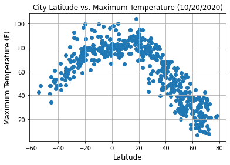


# Observation for Latitude vs Temperature
The further someone is away from the equator to the south, the lower the temperature. And conversely the further north from the equator the higher the temperature.

## Latitude vs. Humidity Plot


```python
# Generate a scatter plot for Latitude vs. Humidity Plot
city_plot(cleaned_city_df,'Humidity')
```


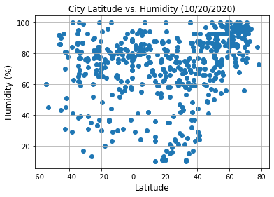


# Observation for Humidity
There are quite a few points where the humitity is higher for both south of the equator and north of the equator but there are also quite a few points that do not exhibit this behavior.  So any correlection would be moderate or weak.

## Latitude vs. Cloudiness Plot


```python
# Generate a scatter plot for Latitude vs. Cloudiness Plot
city_plot(cleaned_city_df,'Cloudiness')
```


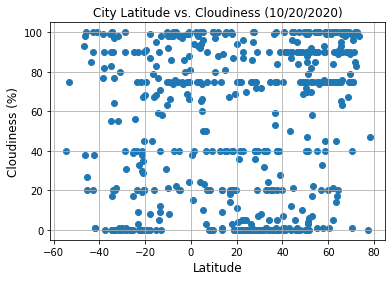


# Observation for Cloudiness
The cloudiness points are distributed over the entire plot.  Therefore there would be "none or very weak" correletion between latitude and Cloudiness.

## Latitude vs. Wind Speed Plot


```python
# Generate a scatter plot for Latitude vs. Wind Speed Plot
city_plot(cleaned_city_df,'Wind Speed')
```


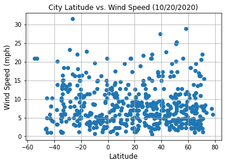


# Observations for Wind Speed
There is not any correletion between Wind Speed and Latitude.   Most of the points are less than 20 mph with very few outliers.

## Linear Regression


```python
def linear_regress(df,compare_what,hemisphere):
    ''' Process linear regression and plot for a given
        DataFrame, plot type and hemisphere'''
    
    # Restrict DataFrame for the requested hemisphere
    if hemisphere == 'Southern':
        hemisphere_df = df.loc[df['Lat'] < 0]
    else:
        hemisphere_df = df.loc[df['Lat'] > 0]
    
    # Set the x and y axis
    x_axis = hemisphere_df['Lat']
    y_axis =hemisphere_df[compare_what]

    # Perform the linear regression
    (slope, intercept, rvalue, pvalue, stderr) = linregress(x_axis, y_axis)
    
    # Setup the labels for our plot
    (plot_label, y_label, northern_annotate, southern_annotate) = setup_labels(compare_what)
    
    # Output the R value
    print(f"The R-Value between Latitude and {compare_what} is {round(rvalue,2)} for the {hemisphere} Hemisphere")

    # Get the regress values
    regress_values = x_axis * slope + intercept

    # Setup the line equation
    line_eq = "y = " + str(round(slope,2)) + "x + " + str(round(intercept,2))

    # Generate the scatter plot for the line regression
    plt.scatter(x_axis,y_axis)

    # Inclue the line
    plt.plot(x_axis,regress_values,"r-")

    # Setup the labels and title for the plot
    plt.xlabel('Latitude', fontsize=12)
    plt.ylabel(y_label, fontsize=12)
    plt.title(f'City Latitude vs {plot_label} ({today})', fontsize=12)

    # Add the line equation
    if hemisphere == "Northern":
        plt.annotate(line_eq,(northern_annotate),fontsize=15,color="red")
    else:
        plt.annotate(line_eq,(southern_annotate),fontsize=15,color="red")

    # Save the plot
    compare_what_no_space = compare_what.replace(' ' ,'_')
    output_file = f'../output_data/{hemisphere}_Hemisphere_{compare_what_no_space}.png'
    plt.savefig(output_file)        
      
    # Show the chart
    plt.show()
```

####  Northern Hemisphere - Max Temp vs. Latitude Linear Regression


```python
# Generate linear regression for Northern Hemisphere - Max Temp vs. Latitude
linear_regress(cleaned_city_df,'Max Temp','Northern')
```

    The R-Value between Latitude and Max Temp is -0.9 for the Northern Hemisphere
    


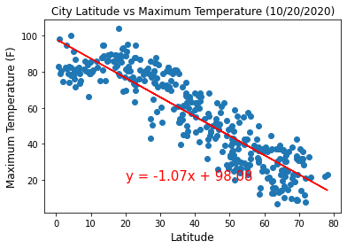


####  Southern Hemisphere - Max Temp vs. Latitude Linear Regression


```python
# Generate linear regression for Southern Hemisphere - Max Temp vs. Latitude
linear_regress(cleaned_city_df,'Max Temp','Southern')
```

    The R-Value between Latitude and Max Temp is 0.77 for the Southern Hemisphere
    


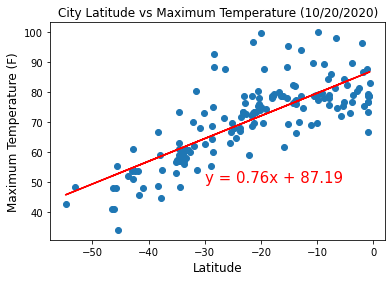


# Observations for Maximum Temerature
There is a strong correlation between latitude and temperature for both Northern and Southern hemisperes.   It is a positive correctlation for the Southern hemisphere and a negative correlation for the Northern hemisphere.   Therefore as the latitude increases so do the temperature and as the latitude decreases so does the temperature.

####  Northern Hemisphere - Humidity (%) vs. Latitude Linear Regression


```python
# Generate linear regression for Northern Hemisphere - Humidity (%) vs. Latitude
linear_regress(cleaned_city_df,'Humidity','Northern')
```

    The R-Value between Latitude and Humidity is 0.39 for the Northern Hemisphere
    


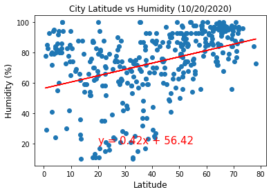


####  Southern Hemisphere - Humidity (%) vs. Latitude Linear Regression


```python
# Generate linear regression for Southern Hemisphere - Humidity (%) vs. Latitude
linear_regress(cleaned_city_df,'Humidity','Southern')
```

    The R-Value between Latitude and Humidity is 0.01 for the Southern Hemisphere
    


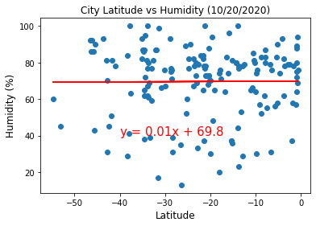


# Observaions for Humidity
There is  "weak" postitive correlation between latitude and humitity for the Southern Hemisphere but the Northern Hemisphere has "none or very weak" correclation.  I have gotten "none or very weak" and "weak" correlation for the Southern hemisphere during other runs but it is always one of those two.  Therefore no conclusions can be drwan for humidity from latitude.

####  Northern Hemisphere - Cloudiness (%) vs. Latitude Linear Regression


```python
# Generate linear regression for Northern Hemisphere - Cloudiness (%) vs. Latitude 
linear_regress(cleaned_city_df,'Cloudiness','Northern')
```

    The R-Value between Latitude and Cloudiness is 0.28 for the Northern Hemisphere
    


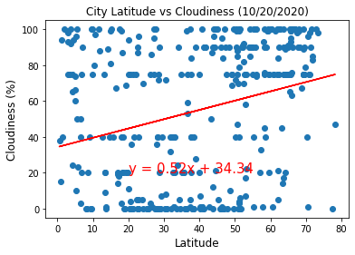


####  Southern Hemisphere - Cloudiness (%) vs. Latitude Linear Regression


```python
# Generate linear regression for Southern Hemisphere - Cloudiness (%) vs. Latitude
linear_regress(cleaned_city_df,'Cloudiness','Southern')
```

    The R-Value between Latitude and Cloudiness is 0.2 for the Southern Hemisphere
    


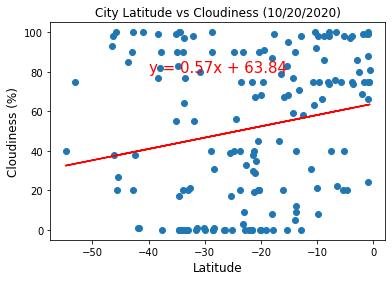


# Observaions for Cloudiness
The correlation for Cloudiness has "none or very weak" correlation for both the Northern and Southern hemispheres.  There can't be any conculsion drawn for Wind Speed from Cloudiness

####  Northern Hemisphere - Wind Speed (mph) vs. Latitude Linear Regression


```python
# Generate linear regression for Northern Hemisphere - Wind Speed (mph) vs. Latitude
linear_regress(cleaned_city_df,'Wind Speed','Northern')
```

    The R-Value between Latitude and Wind Speed is -0.03 for the Northern Hemisphere
    


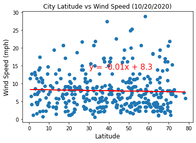


####  Southern Hemisphere - Wind Speed (mph) vs. Latitude Linear Regression


```python
# Generate linear regression for Southern Hemisphere - Wind Speed (mph) vs. Latitude
linear_regress(cleaned_city_df,'Wind Speed','Southern')
```

    The R-Value between Latitude and Wind Speed is -0.11 for the Southern Hemisphere
    


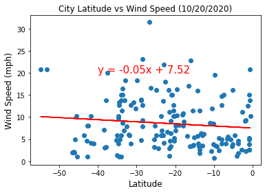


# Observations for Wind Speed
The correlation for Wind Speed for both Northern and Southern hemisperes have "none or very weak correlation".   The Northern is postive and the Southern is negative.  There can't be any conculsion drawn for Wind Speed from Latitude.


# VacationPy
----

#### Note
* Keep an eye on your API usage. Use https://developers.google.com/maps/reporting/gmp-reporting as reference for how to monitor your usage and billing.

* Instructions have been included for each segment. You do not have to follow them exactly, but they are included to help you think through the steps.


```python
# Dependencies and Setup
import matplotlib.pyplot as plt
import pandas as pd
import numpy as np
import requests
import gmaps
import os
import pprint

# Import API key
from api_keys import g_key
```

### Store Part I results into DataFrame
* Load the csv exported in Part I to a DataFrame


```python
# Set the path to citis.csv
cities_path = "../output_data/cities.csv"

# Read the cities.csv
cities_df = pd.read_csv(cities_path)

# # Set the index to the City ID
cities_df = cities_df.set_index('City ID')

# output cities_df
cities_df
```


<div>
<style scoped>
    .dataframe tbody tr th:only-of-type {
        vertical-align: middle;
    }

    .dataframe tbody tr th {
        vertical-align: top;
    }

    .dataframe thead th {
        text-align: right;
    }
</style>
<table border="1" class="dataframe">
  <thead>
    <tr style="text-align: right;">
      <th></th>
      <th>City</th>
      <th>Cloudiness</th>
      <th>Country</th>
      <th>Date</th>
      <th>Humidity</th>
      <th>Lat</th>
      <th>Lng</th>
      <th>Max Temp</th>
      <th>Wind Speed</th>
    </tr>
    <tr>
      <th>City ID</th>
      <th></th>
      <th></th>
      <th></th>
      <th></th>
      <th></th>
      <th></th>
      <th></th>
      <th></th>
      <th></th>
    </tr>
  </thead>
  <tbody>
    <tr>
      <th>0</th>
      <td>Bluff</td>
      <td>93</td>
      <td>NZ</td>
      <td>1603217426</td>
      <td>92</td>
      <td>-46.60</td>
      <td>168.33</td>
      <td>41.00</td>
      <td>1.99</td>
    </tr>
    <tr>
      <th>1</th>
      <td>São João da Barra</td>
      <td>75</td>
      <td>BR</td>
      <td>1603217426</td>
      <td>65</td>
      <td>-21.64</td>
      <td>-41.05</td>
      <td>78.80</td>
      <td>16.11</td>
    </tr>
    <tr>
      <th>2</th>
      <td>Ushuaia</td>
      <td>40</td>
      <td>AR</td>
      <td>1603217130</td>
      <td>60</td>
      <td>-54.80</td>
      <td>-68.30</td>
      <td>42.80</td>
      <td>20.80</td>
    </tr>
    <tr>
      <th>3</th>
      <td>Ponta do Sol</td>
      <td>18</td>
      <td>CV</td>
      <td>1603217426</td>
      <td>52</td>
      <td>17.20</td>
      <td>-25.09</td>
      <td>89.60</td>
      <td>20.80</td>
    </tr>
    <tr>
      <th>4</th>
      <td>High Level</td>
      <td>40</td>
      <td>CA</td>
      <td>1603217366</td>
      <td>100</td>
      <td>58.52</td>
      <td>-117.14</td>
      <td>12.20</td>
      <td>2.24</td>
    </tr>
    <tr>
      <th>...</th>
      <td>...</td>
      <td>...</td>
      <td>...</td>
      <td>...</td>
      <td>...</td>
      <td>...</td>
      <td>...</td>
      <td>...</td>
      <td>...</td>
    </tr>
    <tr>
      <th>520</th>
      <td>Ryōtsu-minato</td>
      <td>0</td>
      <td>JP</td>
      <td>1603218098</td>
      <td>59</td>
      <td>38.08</td>
      <td>138.43</td>
      <td>60.04</td>
      <td>9.46</td>
    </tr>
    <tr>
      <th>521</th>
      <td>Talakan</td>
      <td>100</td>
      <td>RU</td>
      <td>1603218099</td>
      <td>78</td>
      <td>50.32</td>
      <td>130.37</td>
      <td>39.25</td>
      <td>8.72</td>
    </tr>
    <tr>
      <th>522</th>
      <td>Bristol</td>
      <td>90</td>
      <td>US</td>
      <td>1603218084</td>
      <td>82</td>
      <td>41.83</td>
      <td>-71.17</td>
      <td>66.20</td>
      <td>4.70</td>
    </tr>
    <tr>
      <th>523</th>
      <td>Namatanai</td>
      <td>74</td>
      <td>PG</td>
      <td>1603218099</td>
      <td>78</td>
      <td>-3.67</td>
      <td>152.43</td>
      <td>78.89</td>
      <td>1.86</td>
    </tr>
    <tr>
      <th>524</th>
      <td>Paamiut</td>
      <td>100</td>
      <td>GL</td>
      <td>1603217843</td>
      <td>91</td>
      <td>61.99</td>
      <td>-49.67</td>
      <td>36.91</td>
      <td>18.45</td>
    </tr>
  </tbody>
</table>
<p>525 rows × 9 columns</p>
</div>


### Humidity Heatmap
* Configure gmaps.
* Use the Lat and Lng as locations and Humidity as the weight.
* Add Heatmap layer to map.


```python
# Configure gmaps with API key
gmaps.configure(api_key=g_key)

# Store 'Lat' and 'Lng' into  locations 
locations = cities_df[["Lat", "Lng"]].astype(float)

# Define weights
weights = cities_df['Humidity'].astype(float)

# Genearte figure
cities_fig = gmaps.figure()

# Define heat layer
heat_layer = gmaps.heatmap_layer(locations, weights=weights, 
                                 dissipating=False, max_intensity=100,
                                 point_radius = 1)
# Add heat layer to figure
cities_fig.add_layer(heat_layer)

# Show the heatmap
cities_fig
```

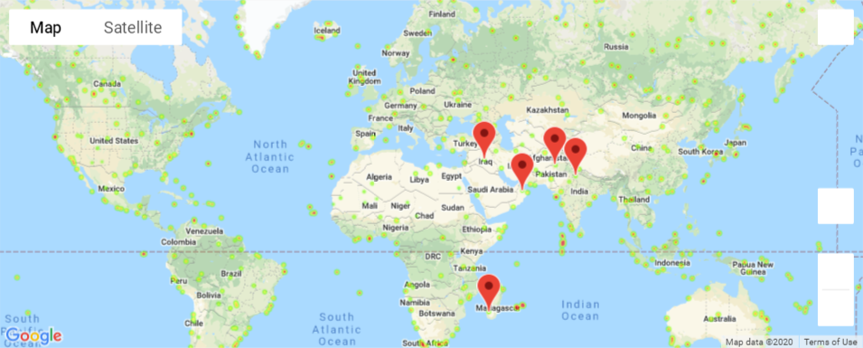


### Create new DataFrame fitting weather criteria
* Narrow down the cities to fit weather conditions.
* Drop any rows will null values.


```python
# Drop any null values
cities_df = cities_df.dropna()

# Setup variables for searching for the perfect vacation spot
low_temp = 70
high_temp = 80
max_wind_speed = 10
cloudiness = 0
humidity = 35

# Create a DataFrame with only cities that have our ideal weather
vacation_cities_df = cities_df.loc[cities_df['Wind Speed'] < max_wind_speed]
vacation_cities_df = vacation_cities_df.loc[vacation_cities_df['Cloudiness'] ==  cloudiness]
vacation_cities_df = vacation_cities_df.loc[vacation_cities_df['Max Temp'] > low_temp]
vacation_cities_df = vacation_cities_df.loc[vacation_cities_df['Max Temp'] < high_temp]
vacation_cities_df = vacation_cities_df.loc[vacation_cities_df['Humidity'] < humidity]
vacation_cities_df
```


<div>
<style scoped>
    .dataframe tbody tr th:only-of-type {
        vertical-align: middle;
    }

    .dataframe tbody tr th {
        vertical-align: top;
    }

    .dataframe thead th {
        text-align: right;
    }
</style>
<table border="1" class="dataframe">
  <thead>
    <tr style="text-align: right;">
      <th></th>
      <th>City</th>
      <th>Cloudiness</th>
      <th>Country</th>
      <th>Date</th>
      <th>Humidity</th>
      <th>Lat</th>
      <th>Lng</th>
      <th>Max Temp</th>
      <th>Wind Speed</th>
    </tr>
    <tr>
      <th>City ID</th>
      <th></th>
      <th></th>
      <th></th>
      <th></th>
      <th></th>
      <th></th>
      <th></th>
      <th></th>
      <th></th>
    </tr>
  </thead>
  <tbody>
    <tr>
      <th>155</th>
      <td>Hīt</td>
      <td>0</td>
      <td>IQ</td>
      <td>1603217626</td>
      <td>25</td>
      <td>33.64</td>
      <td>42.83</td>
      <td>78.82</td>
      <td>8.86</td>
    </tr>
    <tr>
      <th>215</th>
      <td>Naraura</td>
      <td>0</td>
      <td>IN</td>
      <td>1603217692</td>
      <td>21</td>
      <td>28.20</td>
      <td>78.38</td>
      <td>73.98</td>
      <td>3.09</td>
    </tr>
    <tr>
      <th>264</th>
      <td>Nizwá</td>
      <td>0</td>
      <td>OM</td>
      <td>1603217763</td>
      <td>21</td>
      <td>22.93</td>
      <td>57.53</td>
      <td>72.70</td>
      <td>2.66</td>
    </tr>
    <tr>
      <th>378</th>
      <td>Kulachi</td>
      <td>0</td>
      <td>PK</td>
      <td>1603217962</td>
      <td>21</td>
      <td>31.93</td>
      <td>70.46</td>
      <td>70.81</td>
      <td>1.39</td>
    </tr>
    <tr>
      <th>458</th>
      <td>Sakaraha</td>
      <td>0</td>
      <td>MG</td>
      <td>1603218029</td>
      <td>33</td>
      <td>-22.90</td>
      <td>44.53</td>
      <td>76.26</td>
      <td>4.18</td>
    </tr>
  </tbody>
</table>
</div>


### Hotel Map
* Store into variable named `hotel_df`.
* Add a "Hotel Name" column to the DataFrame.
* Set parameters to search for hotels with 5000 meters.
* Hit the Google Places API for each city's coordinates.
* Store the first Hotel result into the DataFrame.
* Plot markers on top of the heatmap.


```python
# create a new dataframe and add a Hotel Name column
hotel_df = pd.DataFrame(vacation_cities_df,
                      columns=['City','Country','Lat','Lng','Hotel Name'])

hotel_df
```


<div>
<style scoped>
    .dataframe tbody tr th:only-of-type {
        vertical-align: middle;
    }

    .dataframe tbody tr th {
        vertical-align: top;
    }

    .dataframe thead th {
        text-align: right;
    }
</style>
<table border="1" class="dataframe">
  <thead>
    <tr style="text-align: right;">
      <th></th>
      <th>City</th>
      <th>Country</th>
      <th>Lat</th>
      <th>Lng</th>
      <th>Hotel Name</th>
    </tr>
    <tr>
      <th>City ID</th>
      <th></th>
      <th></th>
      <th></th>
      <th></th>
      <th></th>
    </tr>
  </thead>
  <tbody>
    <tr>
      <th>155</th>
      <td>Hīt</td>
      <td>IQ</td>
      <td>33.64</td>
      <td>42.83</td>
      <td>NaN</td>
    </tr>
    <tr>
      <th>215</th>
      <td>Naraura</td>
      <td>IN</td>
      <td>28.20</td>
      <td>78.38</td>
      <td>NaN</td>
    </tr>
    <tr>
      <th>264</th>
      <td>Nizwá</td>
      <td>OM</td>
      <td>22.93</td>
      <td>57.53</td>
      <td>NaN</td>
    </tr>
    <tr>
      <th>378</th>
      <td>Kulachi</td>
      <td>PK</td>
      <td>31.93</td>
      <td>70.46</td>
      <td>NaN</td>
    </tr>
    <tr>
      <th>458</th>
      <td>Sakaraha</td>
      <td>MG</td>
      <td>-22.90</td>
      <td>44.53</td>
      <td>NaN</td>
    </tr>
  </tbody>
</table>
</div>


```python
# find the closest hotel for all of our possible vacation cities

# Define the base url
base_url = "https://maps.googleapis.com/maps/api/place/nearbysearch/json"


# use iterrows to iterate through possible vacation cities
for index, row in hotel_df.iterrows():
    
    # Set a variable for the latitude and Longitude of our city
    city_lat_lng = f"{row['Lat']},{row['Lng']}"
    
    # Define the api call parameters
    params = {
               "location": city_lat_lng,
               "radius": 5000,
               "rankby": "distance",
               "types": "lodging",
               "key": g_key
             }
    # Output that we are retrieving information for our city
    print(f"Retrieving Results for Index {index}: {row['City']}, {row['Country']}.")
   
    # assemble url and make API request
    response_json = requests.get(base_url, params=params).json()
    
    # extract results
    results = response_json['results']

    # If we got a hotel add it to the DataFrame
    # if we don't get a hotel then output a message that we are skipping it
    try:
        # Output the closet hotel
        print(f"Closest hotel is {results[0]['name']}.")
        
        # Update the data frame with the hotel name
        hotel_df.loc[index,'Hotel Name'] = results[0]['name']
 
    except (KeyError, IndexError):
        print("Missing field/result... skipping.")
        
    print("-----------------------------------------------------")

# Output hotel_df
hotel_df   
```

    Retrieving Results for Index 155: Hīt, IQ.
    Missing field/result... skipping.
    -----------------------------------------------------
    Retrieving Results for Index 215: Naraura, IN.
    Missing field/result... skipping.
    -----------------------------------------------------
    Retrieving Results for Index 264: Nizwá, OM.
    Missing field/result... skipping.
    -----------------------------------------------------
    Retrieving Results for Index 378: Kulachi, PK.
    Missing field/result... skipping.
    -----------------------------------------------------
    Retrieving Results for Index 458: Sakaraha, MG.
    Missing field/result... skipping.
    -----------------------------------------------------
    


<div>
<style scoped>
    .dataframe tbody tr th:only-of-type {
        vertical-align: middle;
    }

    .dataframe tbody tr th {
        vertical-align: top;
    }

    .dataframe thead th {
        text-align: right;
    }
</style>
<table border="1" class="dataframe">
  <thead>
    <tr style="text-align: right;">
      <th></th>
      <th>City</th>
      <th>Country</th>
      <th>Lat</th>
      <th>Lng</th>
      <th>Hotel Name</th>
    </tr>
    <tr>
      <th>City ID</th>
      <th></th>
      <th></th>
      <th></th>
      <th></th>
      <th></th>
    </tr>
  </thead>
  <tbody>
    <tr>
      <th>155</th>
      <td>Hīt</td>
      <td>IQ</td>
      <td>33.64</td>
      <td>42.83</td>
      <td>NaN</td>
    </tr>
    <tr>
      <th>215</th>
      <td>Naraura</td>
      <td>IN</td>
      <td>28.20</td>
      <td>78.38</td>
      <td>NaN</td>
    </tr>
    <tr>
      <th>264</th>
      <td>Nizwá</td>
      <td>OM</td>
      <td>22.93</td>
      <td>57.53</td>
      <td>NaN</td>
    </tr>
    <tr>
      <th>378</th>
      <td>Kulachi</td>
      <td>PK</td>
      <td>31.93</td>
      <td>70.46</td>
      <td>NaN</td>
    </tr>
    <tr>
      <th>458</th>
      <td>Sakaraha</td>
      <td>MG</td>
      <td>-22.90</td>
      <td>44.53</td>
      <td>NaN</td>
    </tr>
  </tbody>
</table>
</div>


```python
# NOTE: Do not change any of the code in this cell

# Using the template add the hotel marks to the heatmap
info_box_template = """
<dl>
<dt>Name</dt><dd>{Hotel Name}</dd>
<dt>City</dt><dd>{City}</dd>
<dt>Country</dt><dd>{Country}</dd>
</dl>
"""
# Store the DataFrame Row
# NOTE: be sure to update with your DataFrame name
hotel_info = [info_box_template.format(**row) for index, row in hotel_df.iterrows()]
locations = hotel_df[["Lat", "Lng"]]
```


```python
# Add marker layer ontop of heat map
markers = gmaps.marker_layer(locations, info_box_content=hotel_info)
cities_fig.add_layer(markers)

# Display Map
cities_fig
```


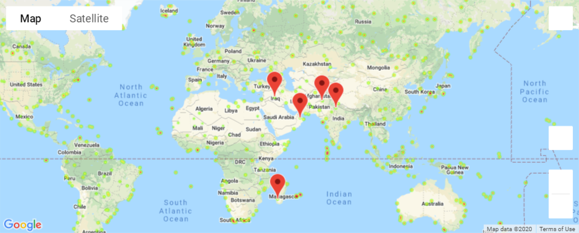


```python

```
